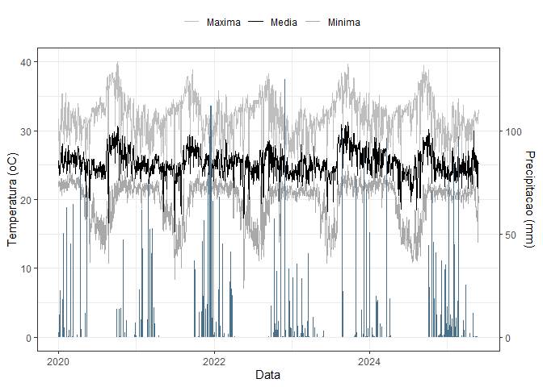
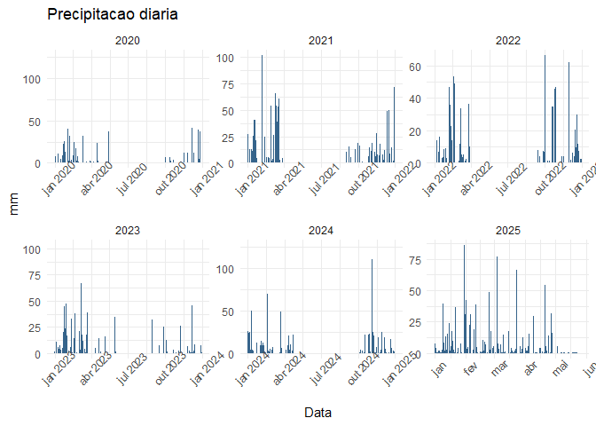

<!-- README.md is generated from README.Rmd. Please edit that file -->

# TCC Neucy

<!-- badges: start -->

<!-- badges: end -->

## Carregando pacotes

``` r
library(tidyverse)
# library(zoo)
library(trend)
library(ggpubr)
# library(DescTools)
# library(scales)
library(corrplot)
```

## Carregando dados

``` r
dados_climatico <- read_rds("data/dados-climaticos.rds")
glimpse(dados_climatico)
#> Rows: 1,974
#> Columns: 10
#> $ data            <dttm> 2020-01-01, 2020-01-02, 2020-01-03, 2020-01-04, 2020-…
#> $ ano             <dbl> 2020, 2020, 2020, 2020, 2020, 2020, 2020, 2020, 2020, …
#> $ mes             <dbl> 1, 1, 1, 1, 1, 1, 1, 1, 1, 1, 1, 1, 1, 1, 1, 1, 1, 1, …
#> $ dia             <int> 1, 2, 3, 4, 5, 6, 7, 8, 9, 10, 11, 12, 13, 14, 15, 16,…
#> $ dia_juliano     <dbl> 1, 2, 3, 4, 5, 6, 7, 8, 9, 10, 11, 12, 13, 14, 15, 16,…
#> $ temp_max        <dbl> 31.7, 29.3, 27.9, 25.1, 29.6, 28.9, 30.8, 26.5, 28.3, …
#> $ temp_min        <dbl> 21.8, 22.6, 22.7, 22.7, 22.6, 22.7, 21.2, 22.5, 22.1, …
#> $ temp_media      <dbl> 25.6, 25.1, 24.0, 23.5, 24.9, 24.8, 25.0, 23.8, 24.8, …
#> $ precipitacao    <dbl> 0.2, 1.2, 8.0, 7.6, 0.0, 5.4, 10.6, 34.2, 0.2, 11.2, 0…
#> $ preci_acumulada <dbl> 0.2, 1.4, 9.4, 17.0, 17.0, 22.4, 33.0, 67.2, 67.4, 78.…
```

## Gráfico

``` r
dados_climatico |> 
  select(data, temp_max, temp_min, temp_media, precipitacao) |> 
  pivot_longer(cols = temp_max:temp_media,
               names_to = "variavel",
               values_to = "valores") |> 
  mutate(
    variavel = case_when(
      variavel == "temp_max" ~ "Maxima",
      variavel == "temp_media" ~ "Media",
      variavel == "temp_min" ~ "Minima"
    )
  ) |> 
  ggplot(aes(x = data)) +
  # barras de precipitação (em escala secundária)
  geom_line(aes(y = valores, color = variavel), size = .25) +
  geom_col(aes(y = precipitacao * 0.2),  # ajuste o fator (0.2) conforme a escala
           fill = "skyblue4") +
  # linhas de temperatura
  theme_bw() +
  scale_color_manual(values = c("gray", "black", "darkgray")) +
  scale_y_continuous(
    name = "Temperatura (oC)",
    limits = c(0, 40), 
    sec.axis = sec_axis(~./0.3, name = "Precipitacao (mm)") # inverso do fator usado
  ) +
  labs(
    color = "",
    x = "Data"
  ) +
  theme(
    legend.position = "top"
  ) 
```

<!-- -->

## Estatísticas descritivas gerais

``` r
resumo_geral <- dados_climatico  |> 
  summarise(
    temp_min_media = mean(temp_min, na.rm = TRUE),
    temp_med_media = mean(temp_media, na.rm = TRUE),
    temp_max_media = mean(temp_max, na.rm = TRUE),
    prec_media = mean(precipitacao, na.rm = TRUE),
    temp_min_sd = sd(temp_min, na.rm = TRUE),
    temp_med_sd = sd(temp_media, na.rm = TRUE),
    temp_max_sd = sd(temp_max, na.rm = TRUE),
    prec_sd = sd(precipitacao, na.rm = TRUE),
    n_dias = n()
  )
resumo_geral
#> # A tibble: 1 × 9
#>   temp_min_media temp_med_media temp_max_media prec_media temp_min_sd
#>            <dbl>          <dbl>          <dbl>      <dbl>       <dbl>
#> 1           19.8           25.2           32.1       5.33        3.03
#> # ℹ 4 more variables: temp_med_sd <dbl>, temp_max_sd <dbl>, prec_sd <dbl>,
#> #   n_dias <int>
```

## Estatísticas mensais

``` r
resumo_mensal <- dados_climatico  |> 
  group_by(ano, mes)  |> 
  summarise(
    temp_min = mean(temp_min, na.rm = TRUE),
    temp_med = mean(temp_media, na.rm = TRUE),
    temp_max = mean(temp_max, na.rm = TRUE),
    prec_total = sum(precipitacao, na.rm = TRUE),
    .groups = "drop"
  )
resumo_mensal
#> # A tibble: 65 × 6
#>      ano   mes temp_min temp_med temp_max prec_total
#>    <dbl> <dbl>    <dbl>    <dbl>    <dbl>      <dbl>
#>  1  2020     1     22.2     25.6     31.2      376. 
#>  2  2020     2     22.5     25.7     31.1      360. 
#>  3  2020     3     22.5     26.0     31.3      171. 
#>  4  2020     4     21.6     25.7     30.9      103. 
#>  5  2020     5     17.9     23.5     29.9       71.4
#>  6  2020     6     17.4     24.6     32.6        0  
#>  7  2020     7     15.6     24.4     33.4        0  
#>  8  2020     8     16.1     25.5     34.7        0  
#>  9  2020     9     19.4     28.1     37.0        0  
#> 10  2020    10     21.8     27.3     34.8       86.8
#> # ℹ 55 more rows
```

## Gráficos de tendência temporal

### Temperatura média diária

``` r
dados_climatico |> 
  ggplot(aes(x = data, y = temp_media)) +
  geom_line(color = "darkred", alpha = 0.6) +
  geom_smooth(method = "loess", se = FALSE, color = "black") +
  labs(title = "Temperatura media diaria", x = "Data", y = "oC") +
  theme_minimal()
```

<!-- -->

## Precipitação diária

``` r
dados_climatico |> 
  ggplot(aes(x = data, y = precipitacao)) +
  geom_col(fill = "steelblue4") +
  labs(title = "Precipitacao diaria", x = "Data", y = "mm") +
  theme_minimal() +
  facet_wrap(~ano,scale="free") +
  theme(
    axis.text.x = element_text(angle = 45)
  )
```

<!-- -->

## Boxplots mensais (sazonalidade)

``` r
dados_climatico |> 
  ggplot(aes(x = as_factor(mes), y = temp_media)) +
  geom_boxplot(fill = "orange4", alpha = 0.7) +
  labs(title = "Distribuicao mensal da temperatura media", x = "Mes", y = "oC") +
  theme_minimal()
```

<!-- -->

``` r
dados_climatico |> 
  ggplot(aes(x = as_factor(mes), y = precipitacao)) +
  geom_boxplot(fill = "skyblue3", alpha = 0.7) +
  labs(title = "Distribuicao mensal da precipitacao diaria", x = "Mes", y = "mm") +
  theme_minimal()
```

<!-- -->

## Correlação entre variáveis

``` r
cor_matriz <- dados_climatico %>%
  select(temp_min, temp_media, temp_max, precipitacao) %>%
  cor(use = "pairwise.complete.obs")

corrplot(cor_matriz, method = "color", addCoef.col = "grey6")
```

<!-- -->

## Análises de extremos

``` r
# Dias de chuva
dias_chuva <- sum(dados_climatico$precipitacao > 1, na.rm = TRUE)

# Dias secos consecutivos
dias_secos <- rle(dados_climatico$precipitacao == 0)$lengths
max_dias_secos <- max(dias_secos)

# Ondas de calor (dias com T > p90)
limite_calor <- quantile(dados_climatico$temp_max, 0.9, na.rm = TRUE)
ondas_calor <- sum(dados_climatico$temp_max > limite_calor, na.rm = TRUE)
dias_chuva
#> [1] 609
max_dias_secos
#> [1] 141
ondas_calor
#> [1] 198
```

``` r
# ------------------------------------------------------------
# 9. Gráfico tipo climograma
# ------------------------------------------------------------
climograma <- resumo_mensal %>%
  ggplot(aes(x = mes)) +
  geom_col(aes(y = prec_total), fill = "steelblue4", alpha = 0.6) +
  geom_line(aes(y = temp_med * 50, group = 1), color = "red", size = 1.1) +
  scale_y_continuous(
    name = "Precipitacao (mm)",
    sec.axis = sec_axis(~./50, name = "Temperatura media (oC)")
  ) +
  labs(title = "Climograma - Precipitacao e Temperatura Media Mensal") +
  theme_minimal()

print(climograma)
```

<!-- -->

## Tendência temporal (Mann-Kendall)

``` r
teste_temp <- mk.test(dados_climatico$temp_media)
print(teste_temp)
#> 
#>  Mann-Kendall trend test
#> 
#> data:  dados_climatico$temp_media
#> z = -4.1334, n = 1974, p-value = 3.575e-05
#> alternative hypothesis: true S is not equal to 0
#> sample estimates:
#>             S          varS           tau 
#> -1.208800e+05  8.552482e+08 -6.225825e-02
```

``` r
ggplot(dados_climatico, aes(x = data, y = temp_media)) +
  geom_line(alpha = 0.6, color = "red4") +
  geom_smooth(method = "lm", se = TRUE, color = "black") +
  labs(title = "Tendencia temporal da temperatura media (2020–2025)",
       x = "Data", y = "Temperatura media (oC)") +
  theme_minimal()
```

<!-- -->
