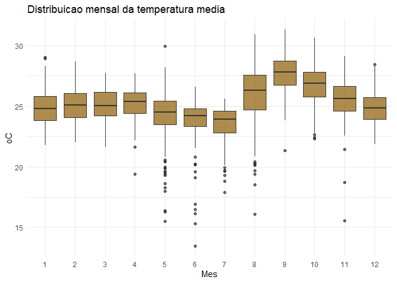
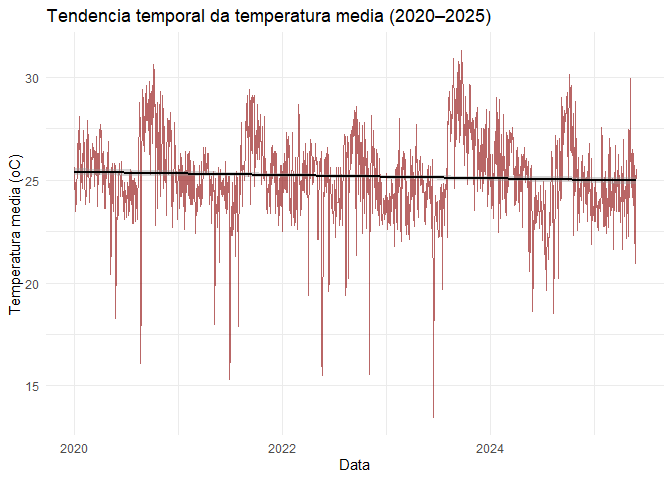
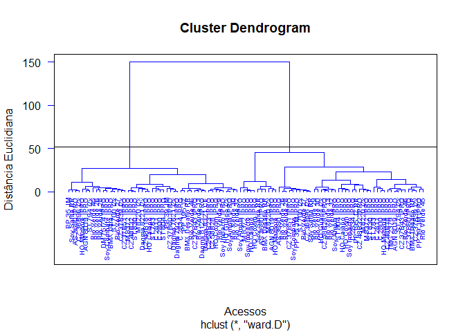
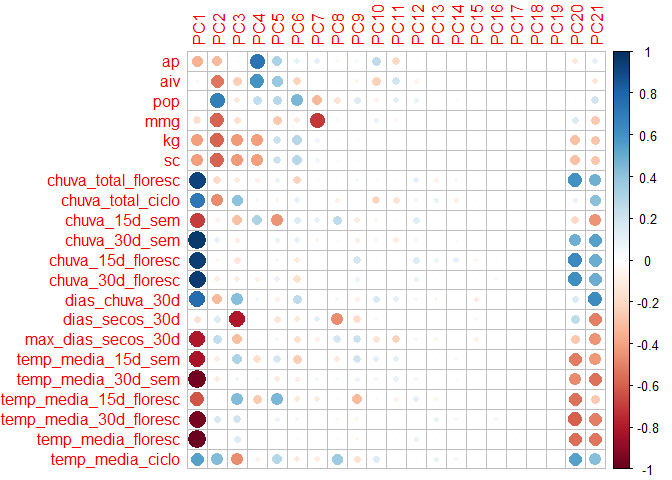
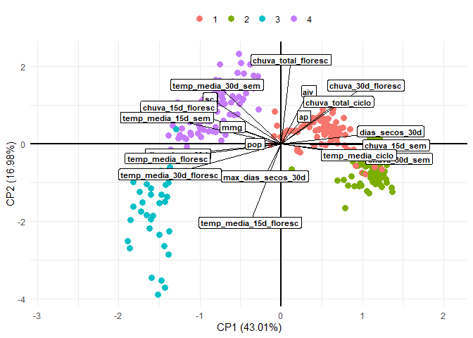
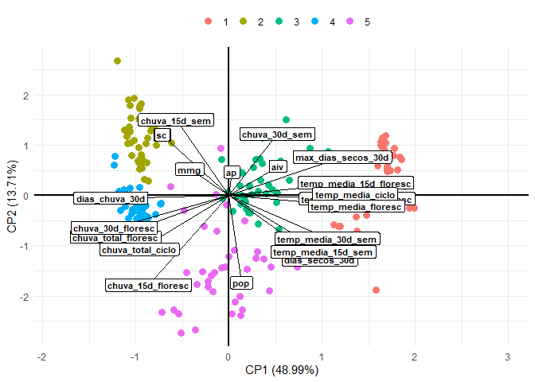

<!-- README.md is generated from README.Rmd. Please edit that file -->

# TCC Neucy - Dados Climáticos

<!-- badges: start -->

<!-- badges: end -->

## Carregando pacotes

``` r
library(tidyverse)
library(trend)
library(ggpubr)
library(corrplot)
library(vegan)
```

## Carregando dados

``` r
dados_climatico <- read_rds("data/dados-climaticos.rds")
glimpse(dados_climatico)
#> Rows: 1,974
#> Columns: 10
#> $ data            <dttm> 2020-01-01, 2020-01-02, 2020-01-03, 2020-01-04, 2020-…
#> $ ano             <dbl> 2020, 2020, 2020, 2020, 2020, 2020, 2020, 2020, 2020, …
#> $ mes             <dbl> 1, 1, 1, 1, 1, 1, 1, 1, 1, 1, 1, 1, 1, 1, 1, 1, 1, 1, …
#> $ dia             <int> 1, 2, 3, 4, 5, 6, 7, 8, 9, 10, 11, 12, 13, 14, 15, 16,…
#> $ dia_juliano     <dbl> 1, 2, 3, 4, 5, 6, 7, 8, 9, 10, 11, 12, 13, 14, 15, 16,…
#> $ temp_max        <dbl> 31.7, 29.3, 27.9, 25.1, 29.6, 28.9, 30.8, 26.5, 28.3, …
#> $ temp_min        <dbl> 21.8, 22.6, 22.7, 22.7, 22.6, 22.7, 21.2, 22.5, 22.1, …
#> $ temp_media      <dbl> 25.6, 25.1, 24.0, 23.5, 24.9, 24.8, 25.0, 23.8, 24.8, …
#> $ precipitacao    <dbl> 0.2, 1.2, 8.0, 7.6, 0.0, 5.4, 10.6, 34.2, 0.2, 11.2, 0…
#> $ preci_acumulada <dbl> 0.2, 1.4, 9.4, 17.0, 17.0, 22.4, 33.0, 67.2, 67.4, 78.…
```

## Gráfico

``` r
plot_climograma <- dados_climatico |> 
  select(data, temp_max, temp_min, temp_media, precipitacao) |> 
  pivot_longer(cols = temp_max:temp_media,
               names_to = "variavel",
               values_to = "valores") |> 
  mutate(
    variavel = case_when(
      variavel == "temp_max" ~ "Maxima",
      variavel == "temp_media" ~ "Media",
      variavel == "temp_min" ~ "Minima"
    )
  ) |> 
  ggplot(aes(x = data)) +
  # barras de precipitação (em escala secundária)
  geom_line(aes(y = valores, color = variavel), size = .25) +
  geom_col(aes(y = precipitacao * 0.2),  # ajuste o fator (0.2) conforme a escala
           fill = "skyblue4") +
  # linhas de temperatura
  theme_bw() +
  scale_color_manual(values = c("gray", "black", "darkgray")) +
  scale_y_continuous(
    name = "Temperatura (oC)",
    limits = c(0, 40), 
    sec.axis = sec_axis(~./0.3, name = "Precipitacao (mm)") # inverso do fator usado
  ) +
  labs(
    color = "",
    x = "Data"
  ) +
  theme(
    legend.position = "top"
  ) 
print(plot_climograma)
```

<!-- -->

## Estatísticas descritivas gerais

``` r
resumo_geral <- dados_climatico  |>
  summarise(
    temp_min_media = mean(temp_min, na.rm = TRUE),
    temp_med_media = mean(temp_media, na.rm = TRUE),
    temp_max_media = mean(temp_max, na.rm = TRUE),
    prec_media = mean(precipitacao, na.rm = TRUE),
    temp_min_sd = sd(temp_min, na.rm = TRUE),
    temp_med_sd = sd(temp_media, na.rm = TRUE),
    temp_max_sd = sd(temp_max, na.rm = TRUE),
    prec_sd = sd(precipitacao, na.rm = TRUE),
    n_dias = n()
  )
resumo_geral
#> # A tibble: 1 × 9
#>   temp_min_media temp_med_media temp_max_media prec_media temp_min_sd
#>            <dbl>          <dbl>          <dbl>      <dbl>       <dbl>
#> 1           19.8           25.2           32.1       5.33        3.03
#> # ℹ 4 more variables: temp_med_sd <dbl>, temp_max_sd <dbl>, prec_sd <dbl>,
#> #   n_dias <int>
```

## Estatísticas mensais

``` r
resumo_mensal <- dados_climatico  |>
  group_by(ano, mes)  |>
  summarise(
    temp_min = mean(temp_min, na.rm = TRUE),
    temp_med = mean(temp_media, na.rm = TRUE),
    temp_max = mean(temp_max, na.rm = TRUE),
    prec_total = sum(precipitacao, na.rm = TRUE),
    .groups = "drop"
  )
resumo_mensal
#> # A tibble: 65 × 6
#>      ano   mes temp_min temp_med temp_max prec_total
#>    <dbl> <dbl>    <dbl>    <dbl>    <dbl>      <dbl>
#>  1  2020     1     22.2     25.6     31.2      376. 
#>  2  2020     2     22.5     25.7     31.1      360. 
#>  3  2020     3     22.5     26.0     31.3      171. 
#>  4  2020     4     21.6     25.7     30.9      103. 
#>  5  2020     5     17.9     23.5     29.9       71.4
#>  6  2020     6     17.4     24.6     32.6        0  
#>  7  2020     7     15.6     24.4     33.4        0  
#>  8  2020     8     16.1     25.5     34.7        0  
#>  9  2020     9     19.4     28.1     37.0        0  
#> 10  2020    10     21.8     27.3     34.8       86.8
#> # ℹ 55 more rows
```

## Gráficos de tendência temporal

### Temperatura média diária

``` r
dados_climatico |>
  ggplot(aes(x = data, y = temp_media)) +
  geom_line(color = "darkred", alpha = 0.6) +
  geom_smooth(method = "loess", se = FALSE, color = "black") +
  labs(title = "Temperatura media diaria", x = "Data", y = "oC") +
  theme_minimal()
```

<!-- -->

## Precipitação diária

``` r
dados_climatico |>
  ggplot(aes(x = data, y = precipitacao)) +
  geom_col(fill = "steelblue4") +
  labs(title = "Precipitacao diaria", x = "Data", y = "mm") +
  theme_minimal() +
  facet_wrap(~ano,scale="free") +
  theme(
    axis.text.x = element_text(angle = 45)
  )
```

<!-- -->

## Boxplots mensais (sazonalidade)

``` r
dados_climatico |>
  ggplot(aes(x = as_factor(mes), y = temp_media)) +
  geom_boxplot(fill = "orange4", alpha = 0.7) +
  labs(title = "Distribuicao mensal da temperatura media",
       x = "Mes", y = "oC") +
  theme_minimal()
```

<!-- -->

``` r
dados_climatico |>
  ggplot(aes(x = as_factor(mes), y = precipitacao)) +
  geom_boxplot(fill = "skyblue3", alpha = 0.7) +
  labs(title = "Distribuicao mensal da precipitacao diaria",
       x = "Mes", y = "mm") +
  theme_minimal()
```

<!-- -->

## Correlação entre variáveis

``` r
cor_matriz <- dados_climatico %>%
  select(temp_min, temp_media, temp_max, precipitacao) %>%
  cor(use = "pairwise.complete.obs")

corrplot(cor_matriz, method = "color", addCoef.col = "grey6")
```

<!-- -->

## Análises de extremos

``` r
# Dias de chuva
dias_chuva <- sum(dados_climatico$precipitacao > 1, na.rm = TRUE)

# Dias secos consecutivos
dias_secos <- rle(dados_climatico$precipitacao == 0)$lengths
max_dias_secos <- max(dias_secos)

# Ondas de calor (dias com T > p90)
limite_calor <- quantile(dados_climatico$temp_max, 0.9, na.rm = TRUE)
ondas_calor <- sum(dados_climatico$temp_max > limite_calor, na.rm = TRUE)
dias_chuva
#> [1] 609
max_dias_secos
#> [1] 141
ondas_calor
#> [1] 198
```

``` r
# Gráfico tipo climograma
climograma <- resumo_mensal %>%
  ggplot(aes(x = mes)) +
  geom_col(aes(y = prec_total), fill = "steelblue4", alpha = 0.6) +
  geom_line(aes(y = temp_med * 50, group = 1), color = "red", size = 1.1) +
  scale_y_continuous(
    name = "Precipitacao (mm)",
    sec.axis = sec_axis(~./50, name = "Temperatura media (oC)")
  ) +
  labs(title = "Climograma - Precipitacao e Temperatura Media Mensal") +
  theme_minimal()

print(climograma)
```

<!-- -->

## Tendência temporal (Mann-Kendall)

``` r
teste_temp <- mk.test(dados_climatico$temp_media)
print(teste_temp)
#> 
#>  Mann-Kendall trend test
#> 
#> data:  dados_climatico$temp_media
#> z = -4.1334, n = 1974, p-value = 3.575e-05
#> alternative hypothesis: true S is not equal to 0
#> sample estimates:
#>             S          varS           tau 
#> -1.208800e+05  8.552482e+08 -6.225825e-02
```

``` r
ggplot(dados_climatico, aes(x = data, y = temp_media)) +
  geom_line(alpha = 0.6, color = "red4") +
  geom_smooth(method = "lm", se = TRUE, color = "black") +
  labs(title = "Tendencia temporal da temperatura media (2020–2025)",
       x = "Data", y = "Temperatura media (oC)") +
  theme_minimal()
```

<!-- -->

# TCC Neucy - Dados Fenotípicos

## Carregando dados

``` r
dados_fenotipicos <- read_rds("data/dados-tcc-neucy.rds")
skimr::skim(dados_fenotipicos)
```

|                                                  |                   |
|:-------------------------------------------------|:------------------|
| Name                                             | dados_fenotipicos |
| Number of rows                                   | 3396              |
| Number of columns                                | 17                |
| \_\_\_\_\_\_\_\_\_\_\_\_\_\_\_\_\_\_\_\_\_\_\_   |                   |
| Column type frequency:                           |                   |
| character                                        | 5                 |
| factor                                           | 1                 |
| numeric                                          | 8                 |
| POSIXct                                          | 3                 |
| \_\_\_\_\_\_\_\_\_\_\_\_\_\_\_\_\_\_\_\_\_\_\_\_ |                   |
| Group variables                                  | None              |

Data summary

**Variable type: character**

| skim_variable | n_missing | complete_rate | min | max | empty | n_unique | whitespace |
|:--------------|----------:|--------------:|----:|----:|------:|---------:|-----------:|
| safra         |         0 |          1.00 |   9 |   9 |     0 |        5 |          0 |
| cultivar      |         0 |          1.00 |   6 |  22 |     0 |      212 |          0 |
| marca         |         0 |          1.00 |   3 |  17 |     0 |       28 |          0 |
| g_m_r         |         0 |          1.00 |   3 |   3 |     0 |       22 |          0 |
| biotec        |        76 |          0.98 |   1 |   4 |     0 |        7 |          0 |

**Variable type: factor**

| skim_variable | n_missing | complete_rate | ordered | n_unique | top_counts |
|:---|---:|---:|:---|---:|:---|
| epoca | 0 | 1 | FALSE | 4 | 2: 1096, 3: 1068, 4: 644, 1: 588 |

**Variable type: numeric**

| skim_variable | n_missing | complete_rate | mean | sd | p0 | p25 | p50 | p75 | p100 | hist |
|:---|---:|---:|---:|---:|---:|---:|---:|---:|---:|:---|
| no | 0 | 1 | 1698.50 | 980.49 | 1.0 | 849.75 | 1698.50 | 2547.25 | 3396.0 | ▇▇▇▇▇ |
| rep | 0 | 1 | 3.60 | 5.99 | 1.0 | 2.00 | 3.00 | 4.00 | 51.0 | ▇▁▁▁▁ |
| ap | 0 | 1 | 81.21 | 14.28 | 32.5 | 71.95 | 81.30 | 91.00 | 131.7 | ▁▃▇▃▁ |
| aiv | 0 | 1 | 15.75 | 3.80 | 6.5 | 13.00 | 15.30 | 18.00 | 37.3 | ▃▇▂▁▁ |
| pop | 0 | 1 | 250874.17 | 75535.71 | 47500.0 | 200000.00 | 245000.00 | 297500.00 | 535000.0 | ▂▇▇▂▁ |
| mmg | 0 | 1 | 170.02 | 21.65 | 109.3 | 154.50 | 170.40 | 183.90 | 251.9 | ▁▆▇▂▁ |
| kg | 0 | 1 | 4485.99 | 833.68 | 2190.6 | 3837.80 | 4527.95 | 5111.58 | 6899.0 | ▁▆▇▆▁ |
| sc | 0 | 1 | 74.77 | 13.89 | 36.5 | 64.00 | 75.50 | 85.20 | 115.0 | ▁▆▇▆▁ |

**Variable type: POSIXct**

| skim_variable | n_missing | complete_rate | min | max | median | n_unique |
|:---|---:|---:|:---|:---|:---|---:|
| data_sem | 0 | 1 | 2020-10-13 | 2024-10-31 | 2023-10-23 | 16 |
| data_floresc | 0 | 1 | 2020-11-12 | 2024-12-16 | 2023-11-26 | 183 |
| data_ciclo | 0 | 1 | 2021-01-25 | 2025-03-03 | 2024-02-01 | 189 |

## Função para criar chuva acumulada e média de temperatura

``` r
get_climate_features <- function(data_ref, 
                                 janela = 15,
                                 df_ref,
                                 feature = "chuva_acumulada"){
  data_ref = lubridate::as_date(data_ref) 
  data_l = lubridate::as_date(data_ref) - days(janela)
  df_aux = df_ref |> 
    filter(data >= data_l & data <= data_ref)
  
  sum_prec = sum(df_aux$precipitacao)
  dias_chuva = sum(df_aux$precipitacao>=1)
  dias_secos = sum(df_aux$precipitacao == 0)
  seco = df_aux$precipitacao < 1
  rle_seco = rle(seco)
  max_dry = ifelse(any(rle_seco$values), max(rle_seco$lengths[rle_seco$values]), 0)
  temp_media = mean(df_aux$temp_media) 
  if(feature == "chuva_acumulada" ) return(sum_prec)
  if(feature == "dias_chuva" ) return(dias_chuva)
  if(feature == "dias_secos" ) return(dias_secos)
  if(feature == "max_dias_secos" ) return(max_dry)
  if(feature == "temp_media" ) return(temp_media)
}
get_climate_features(lubridate::as_date("2020-11-18"),15,dados_climatico,"chuva_acumulada")
#> [1] 29.6
get_climate_features(lubridate::as_date("2020-11-18"),30,dados_climatico,"chuva_acumulada")
#> [1] 95
```

``` r
# dados <- dados_fenotipicos |> 
#   # slice(1:10) |> 
#   rowwise() |>
#   mutate(
#      duracao_floresc = as.numeric(data_floresc - data_sem),
#      duracao_ciclo = as.numeric(data_ciclo - data_sem),
#      chuva_total_floresc = get_climate_features(data_floresc,duracao_floresc,
#                                               dados_climatico,"chuva_acumulada"),
#      chuva_total_ciclo = get_climate_features(data_ciclo,duracao_ciclo,
#                                               dados_climatico,"chuva_acumulada"),
#      chuva_15d_sem = get_climate_features(data_sem,15,dados_climatico,"chuva_acumulada"),
#      chuva_30d_sem = get_climate_features(data_sem,45,dados_climatico,"chuva_acumulada"),
#      chuva_15d_floresc = get_climate_features(data_floresc,janela = 15,df_ref = dados_climatico,"chuva_acumulada"),
#      chuva_30d_floresc = get_climate_features(data_floresc,45,dados_climatico,"chuva_acumulada"),
#      dias_chuva_30d = get_climate_features(data_ciclo,30,
#                                               dados_climatico,"dias_chuva"),
#      dias_secos_30d = get_climate_features(data_ciclo,30,
#                                               dados_climatico,"dias_secos"),
#      max_dias_secos_30d = get_climate_features(data_ciclo,30,
#                                               dados_climatico,"max_dias_secos"),
#      temp_media_15d_sem = get_climate_features(data_sem,15,
#                                                dados_climatico,"temp_media"),
#      temp_media_30d_sem = get_climate_features(data_sem,30,
#                                                dados_climatico,"temp_media"),
#      temp_media_15d_floresc = get_climate_features(data_floresc,15,
#                                                dados_climatico,"temp_media"),
#      temp_media_30d_floresc = get_climate_features(data_floresc,30,
#                                                dados_climatico,"temp_media"),
#      temp_media_floresc = get_climate_features(data_floresc,duracao_floresc,
#                                                dados_climatico,"temp_media"),
#      temp_media_ciclo = get_climate_features(data_floresc,duracao_ciclo,
#                                                dados_climatico,"temp_media"),
#   ) 
# write_rds(dados,"data/dados-agregados.rds")
```

# DADOS AGREGADOS

``` r
dados <- read_rds("data/dados-agregados.rds")
glimpse(dados)  
#> Rows: 3,396
#> Columns: 34
#> Rowwise: 
#> $ no                     <dbl> 1, 2, 3, 4, 5, 6, 7, 8, 9, 10, 11, 12, 13, 14, …
#> $ safra                  <chr> "2020/2021", "2020/2021", "2020/2021", "2020/20…
#> $ epoca                  <fct> 1, 1, 1, 1, 1, 1, 1, 1, 1, 1, 1, 1, 1, 1, 1, 1,…
#> $ cultivar               <chr> "HO Cristalino IPRO", "HO Cristalino IPRO", "HO…
#> $ marca                  <chr> "HO Genética", "HO Genética", "HO Genética", "H…
#> $ g_m_r                  <chr> "8.3", "8.3", "8.3", "8.3", "8.3", "8.3", "8.3"…
#> $ biotec                 <chr> "IPRO", "IPRO", "IPRO", "IPRO", "IPRO", "IPRO",…
#> $ rep                    <dbl> 1, 2, 3, 4, 1, 2, 3, 4, 1, 2, 3, 4, 1, 2, 3, 4,…
#> $ data_sem               <dttm> 2020-10-13, 2020-10-13, 2020-10-13, 2020-10-13…
#> $ data_floresc           <dttm> 2020-11-27, 2020-11-27, 2020-11-27, 2020-11-27…
#> $ data_ciclo             <dttm> 2021-02-20, 2021-02-20, 2021-02-20, 2021-02-20…
#> $ ap                     <dbl> 69.0, 71.5, 66.5, 73.5, 59.0, 54.5, 52.0, 60.5,…
#> $ aiv                    <dbl> 14.0, 14.5, 16.0, 15.5, 13.5, 13.0, 16.0, 14.5,…
#> $ pop                    <dbl> 180000, 180000, 160000, 160000, 210000, 230000,…
#> $ mmg                    <dbl> 152.1, 159.3, 163.8, 151.6, 178.4, 171.2, 168.5…
#> $ kg                     <dbl> 3966.7, 4192.1, 3678.0, 4274.1, 3823.6, 4423.0,…
#> $ sc                     <dbl> 66.1, 69.9, 61.3, 71.2, 63.7, 73.7, 72.0, 64.8,…
#> $ duracao_floresc        <dbl> 45, 45, 45, 45, 43, 43, 43, 43, 36, 34, 34, 36,…
#> $ duracao_ciclo          <dbl> 130, 130, 130, 130, 119, 119, 119, 123, 130, 13…
#> $ chuva_total_floresc    <dbl> 133.8, 133.8, 133.8, 133.8, 121.4, 121.4, 121.4…
#> $ chuva_total_ciclo      <dbl> 882.4, 882.4, 882.4, 882.4, 781.8, 781.8, 781.8…
#> $ chuva_15d_sem          <dbl> 34.6, 34.6, 34.6, 34.6, 34.6, 34.6, 34.6, 34.6,…
#> $ chuva_30d_sem          <dbl> 34.6, 34.6, 34.6, 34.6, 34.6, 34.6, 34.6, 34.6,…
#> $ chuva_15d_floresc      <dbl> 47.2, 47.2, 47.2, 47.2, 34.8, 34.8, 34.8, 34.8,…
#> $ chuva_30d_floresc      <dbl> 133.8, 133.8, 133.8, 133.8, 122.0, 122.0, 122.0…
#> $ dias_chuva_30d         <int> 19, 19, 19, 19, 19, 19, 19, 20, 19, 19, 19, 19,…
#> $ dias_secos_30d         <int> 10, 10, 10, 10, 11, 11, 11, 9, 10, 10, 10, 10, …
#> $ max_dias_secos_30d     <int> 4, 4, 4, 4, 3, 3, 3, 4, 4, 4, 4, 4, 3, 4, 3, 3,…
#> $ temp_media_15d_sem     <dbl> 28.55625, 28.55625, 28.55625, 28.55625, 28.5562…
#> $ temp_media_30d_sem     <dbl> 28.25806, 28.25806, 28.25806, 28.25806, 28.2580…
#> $ temp_media_15d_floresc <dbl> 26.05625, 26.05625, 26.05625, 26.05625, 26.1062…
#> $ temp_media_30d_floresc <dbl> 26.33548, 26.33548, 26.33548, 26.33548, 26.5193…
#> $ temp_media_floresc     <dbl> 26.48696, 26.48696, 26.48696, 26.48696, 26.5159…
#> $ temp_media_ciclo       <dbl> 26.60000, 26.60000, 26.60000, 26.60000, 26.7983…
```

## Análise Multivariada por safra

``` r
agrupamentos <- c(4,4,4,4,4)
safras <- unique(dados$safra)
epocas <- unique(dados$epoca)
for(i in seq_along(safras)){
  # for(j in seq_along(epocas)){
    df_aux <- dados |> 
      filter(
        safra == safras[i],
        # epoca == epocas[j]
      ) |> 
      group_by(cultivar,epoca) |> 
      summarise(across(.cols = ap:temp_media_ciclo,
                       .fns = mean,
                       .names = "{.col}" 
                       
      )) |> ungroup()
    dados_aux <- df_aux |>  select(-cultivar,-epoca,-duracao_floresc,
                                   -duracao_ciclo)
    cultivar <- df_aux$cultivar
    if(nrow(dados_aux) > 10){
      mc <- cor(dados_aux)
      fc <- !is.na(mc[1,])
      fl <- !is.na(mc[,1])
      mc <- mc[fc,fl]
      print("=================================================================")
      print(paste0("ANALISE PARA SAFRA: ",safras[i]))#,"; EPOCA: ",epocas[j]))
      print("=================================================================")
      
      corrplot(mc[1:6,-(1:6)],method = "color",
                         outline = TRUE,
                         addgrid.col = "darkgray",cl.pos = "r", tl.col = "black",
                         tl.cex = 1, cl.cex = 1,  bg="azure2",
                         # diag = FALSE,
                         addCoef.col = "black",
                         cl.ratio = 0.2,
                         cl.length = 5,
                         number.cex = 0.8
                         ) 
      nomes <- colnames(mc)
      da_pad<-decostand(dados_aux |> 
                          select(nomes), 
                          method = "standardize",
                        na.rm=TRUE)
      da_pad_euc<-vegdist(da_pad,"euclidean") 
      da_pad_euc_ward<-hclust(da_pad_euc, method="ward.D")
      da_pad_euc_ward$labels <- cultivar
      grupo<-cutree(da_pad_euc_ward,agrupamentos[i])
      d <- da_pad_euc_ward$height
      d_corte <- d[which(d |> diff() == max(diff(d)))]
      plot(da_pad_euc_ward, 
           ylab="Distância Euclidiana",
           xlab="Acessos", hang=-1,
           col="blue", las=1,
           cex=.6,lwd=1.5);box();abline(h=d_corte*1.15)
      
      print("======== Análise de Componentes Principais ========== ")
      pca <-  prcomp(da_pad,scale.=TRUE)
      # Autovalores
      eig<-pca$sdev^2
      print("==== Autovalores ====")
      print(round(eig,3))
      print("==== % da variância explicada ====")
      ve<-eig/sum(eig)
      print(round(ve,4))
      print("==== % da variância explicada acumulada ====")
      print(round(cumsum(ve),4)*100)
      print("==== Poder Discriminante ====")
      mcor<-cor(da_pad,pca$x)
      corrplot(mcor)
      print("==== screeplot ====")
      # screeplot(pca);abline(h=1)
      
      pc1V<-cor(da_pad,pca$x)[,1]/sd(cor(da_pad,pca$x)[,1])
      pc2V<-cor(da_pad,pca$x)[,2]/sd(cor(da_pad,pca$x)[,2])
      pc3V<-cor(da_pad,pca$x)[,3]/sd(cor(da_pad,pca$x)[,3])
      pc1c<-pca$x[,1]/sd(pca$x[,1])
      pc2c<-pca$x[,2]/sd(pca$x[,2])
      pc3c<-pca$x[,3]/sd(pca$x[,3])
      nv<-ncol(mc) # número de variáveis utilizadas na análise
      
      # gráfico biplot
      bip<-data.frame(pc1c,pc2c,pc3c,grupo)
      texto <- data.frame(
        x = pc1V,
        y = pc2V,
        z = pc3V,
        label = rownames(mc)
      )
      for(k in 1:agrupamentos[i]){
        cat("[Grupo ", paste(k,"]:",cultivar[grupo==k],collapse = "\n"))
        cat("\n\n")
      }
    

      bi_plot <- bip |> 
        ggplot(aes(x=pc1c,y=pc2c,colour = as_factor(grupo))) +
        geom_point(size = 3) +
        theme_minimal() +
        # scale_shape_manual(values=16:18)+
        # scale_color_manual(values=c("#009E73", "#D55E00")) + #"#999999",
        # annotate(geom="text", x=pc1c, y=pc2c, label=cultivar,
        #             color="black",size=.25)+
        geom_vline(aes(xintercept=0),
                   color="black", size=1)+
        geom_hline(aes(yintercept=0),
                   color="black", size=1)+
        annotate(geom="segment",
                 x=rep(0,nv),
                 xend=texto$x,
                 y=rep(0,nv),
                 yend=texto$y,color="black",lwd=.5)+
        geom_label(data=texto,aes(x=x,y=y,label=label),
                   color="black",angle=0,fontface="bold",size=3,fill="white")+
        labs(x=paste("CP1 (",round(100*ve[1],2),"%)",sep=""),
             y=paste("CP2 (",round(100*ve[2],2),"%)",sep=""),
             color="",shape="")+
        theme(legend.position = "top")+
        xlim(min(pc1c)*1.5,max(pc1c)*1.5) 
      print(bi_plot)
      
      print("==== Tabela da correlação dos atributos com cada PC ====")
      ck<-sum(pca$sdev^2>=0.98)
      tabelapca<-vector()
      for( l in 1:ck) tabelapca<-cbind(tabelapca,mcor[,l])
      colnames(tabelapca)<-paste(rep(c("PC"),ck),1:ck,sep="")
      pcat<-round(tabelapca,3)
      tabelapca<-tabelapca[order(abs(tabelapca[,1])),]
      print(tabelapca)
    }
  # }
}
#> [1] "================================================================="
#> [1] "ANALISE PARA SAFRA: 2020/2021"
#> [1] "================================================================="
```

<!-- --><!-- -->

    #> [1] "======== Análise de Componentes Principais ========== "
    #> [1] "==== Autovalores ===="
    #>  [1] 8.946 4.468 2.688 1.423 1.009 0.531 0.510 0.418 0.261 0.217 0.189 0.149
    #> [13] 0.110 0.056 0.014 0.007 0.005 0.000 0.000 0.000 0.000
    #> [1] "==== % da variância explicada ===="
    #>  [1] 0.4260 0.2128 0.1280 0.0678 0.0480 0.0253 0.0243 0.0199 0.0124 0.0103
    #> [11] 0.0090 0.0071 0.0052 0.0027 0.0007 0.0003 0.0002 0.0000 0.0000 0.0000
    #> [21] 0.0000
    #> [1] "==== % da variância explicada acumulada ===="
    #>  [1]  42.60  63.88  76.68  83.45  88.26  90.79  93.22  95.21  96.45  97.48
    #> [11]  98.38  99.09  99.61  99.88  99.95  99.98 100.00 100.00 100.00 100.00
    #> [21] 100.00
    #> [1] "==== Poder Discriminante ===="

<!-- -->

    #> [1] "==== screeplot ===="
    #> [Grupo  1 ]: AGN 8019 IPRO
    #> 1 ]: BMX Desafio RR
    #> 1 ]: CZ 37B43 IPRO
    #> 1 ]: CZ 37B51 IPRO
    #> 1 ]: NEO 750 IPRO
    #> 1 ]: ST 783 IPRO
    #> 1 ]: ST 804 IPRO
    #> 
    #> [Grupo  2 ]: AGN 8019 IPRO
    #> 2 ]: BMX Desafio RR
    #> 2 ]: CZ 37B43 IPRO
    #> 2 ]: CZ 47B90 IPRO
    #> 2 ]: DM 79I81 IPRO
    #> 2 ]: NEO 750 IPRO
    #> 2 ]: NK 7777 IPRO
    #> 2 ]: NS 1657 810
    #> 2 ]: NS 7700 IPRO
    #> 2 ]: NS 8300 IPRO
    #> 
    #> [Grupo  3 ]: BMX Olimpo IPRO
    #> 3 ]: BMX Origem IPRO
    #> 3 ]: CZ 47B90 IPRO
    #> 3 ]: CZ 48B32 IPRO
    #> 3 ]: CZ 58B28 IPRO
    #> 3 ]: HO Cristalino IPRO
    #> 3 ]: HO Juruena IPRO
    #> 3 ]: M 8210 IPRO
    #> 3 ]: M 8372 IPRO
    #> 3 ]: ST 830 IPRO
    #> 3 ]: ST 834 IPRO
    #> 
    #> [Grupo  4 ]: CZ 48B32 IPRO
    #> 4 ]: CZ 58B28 IPRO
    #> 4 ]: HO Cristalino IPRO
    #> 4 ]: HO Juruena IPRO
    #> 4 ]: M 8210 IPRO
    #> 4 ]: M 8372 IPRO
    #> 4 ]: NK 8301 IPRO
    #> 4 ]: NK 8448 IPRO
    #> 4 ]: NS 8400 IPRO
    #> 4 ]: ST 783 IPRO
    #> 4 ]: ST 804 IPRO
    #> 4 ]: ST 830 IPRO
    #> 4 ]: ST 834 IPRO

<!-- -->

    #> [1] "==== Tabela da correlação dos atributos com cada PC ===="
    #>                                 PC1         PC2         PC3         PC4
    #> dias_chuva_30d         -0.003262663 -0.45924597 -0.61279410 -0.54014190
    #> temp_media_15d_floresc  0.071191256  0.73807792 -0.35999372  0.22370057
    #> mmg                    -0.229338602 -0.16324291  0.11760112  0.30324708
    #> dias_secos_30d          0.366342737  0.32116865  0.36386243  0.72297997
    #> pop                    -0.398947601  0.65085818  0.09333041 -0.43626316
    #> chuva_30d_floresc       0.412443417 -0.56194280  0.49122077 -0.02972249
    #> temp_media_ciclo        0.588357723  0.64625921  0.26709234 -0.15965829
    #> chuva_total_floresc     0.618012467 -0.63426267  0.30212932  0.08177434
    #> chuva_15d_floresc       0.619341107 -0.29222177  0.54994716 -0.11650207
    #> temp_media_30d_floresc -0.626450625  0.51505651 -0.45020561  0.13743234
    #> ap                      0.643269549  0.39820348 -0.27166698  0.16588721
    #> kg                      0.660285002 -0.46104181 -0.48000503  0.19222671
    #> sc                      0.660542388 -0.46117578 -0.47998378  0.19193521
    #> chuva_total_ciclo       0.743315626 -0.30497371 -0.50580730  0.11546556
    #> temp_media_floresc     -0.820244966  0.28612238 -0.33700135  0.21827706
    #> max_dias_secos_30d      0.828463906 -0.08470653 -0.43529740 -0.06169801
    #> chuva_15d_sem           0.860116300  0.47537636  0.04789068 -0.10406562
    #> chuva_30d_sem           0.860116300  0.47537636  0.04789068 -0.10406562
    #> temp_media_15d_sem     -0.860116300 -0.47537636 -0.04789068  0.10406562
    #> temp_media_30d_sem     -0.860116300 -0.47537636 -0.04789068  0.10406562
    #> aiv                     0.874150314  0.05332933 -0.12630555 -0.03568441
    #>                                 PC5
    #> dias_chuva_30d         -0.197708610
    #> temp_media_15d_floresc  0.044404281
    #> mmg                    -0.867764521
    #> dias_secos_30d          0.016864942
    #> pop                    -0.137474881
    #> chuva_30d_floresc      -0.155670586
    #> temp_media_ciclo       -0.137051095
    #> chuva_total_floresc     0.130875857
    #> chuva_15d_floresc       0.103496115
    #> temp_media_30d_floresc -0.114668954
    #> ap                      0.222690805
    #> kg                     -0.070867100
    #> sc                     -0.071214867
    #> chuva_total_ciclo      -0.022261852
    #> temp_media_floresc      0.077427311
    #> max_dias_secos_30d     -0.006670158
    #> chuva_15d_sem          -0.102374773
    #> chuva_30d_sem          -0.102374773
    #> temp_media_15d_sem      0.102374773
    #> temp_media_30d_sem      0.102374773
    #> aiv                     0.060131916
    #> [1] "================================================================="
    #> [1] "ANALISE PARA SAFRA: 2021/2022"
    #> [1] "================================================================="

<!-- --><!-- -->

    #> [1] "======== Análise de Componentes Principais ========== "
    #> [1] "==== Autovalores ===="
    #>  [1] 10.516  2.559  2.251  1.523  1.081  0.802  0.696  0.504  0.359  0.274
    #> [11]  0.220  0.109  0.044  0.033  0.020  0.007  0.001  0.000  0.000  0.000
    #> [21]  0.000
    #> [1] "==== % da variância explicada ===="
    #>  [1] 0.5008 0.1219 0.1072 0.0725 0.0515 0.0382 0.0332 0.0240 0.0171 0.0130
    #> [11] 0.0105 0.0052 0.0021 0.0016 0.0010 0.0003 0.0000 0.0000 0.0000 0.0000
    #> [21] 0.0000
    #> [1] "==== % da variância explicada acumulada ===="
    #>  [1]  50.08  62.27  72.99  80.24  85.39  89.20  92.52  94.92  96.63  97.93
    #> [11]  98.98  99.50  99.71  99.87  99.96  99.99 100.00 100.00 100.00 100.00
    #> [21] 100.00
    #> [1] "==== Poder Discriminante ===="

<!-- -->

    #> [1] "==== screeplot ===="
    #> [Grupo  1 ]: AGN 8019 IPRO
    #> 1 ]: AS 3680 IPRO
    #> 1 ]: BMX Desafio RR
    #> 1 ]: HO Caiapó IPRO
    #> 1 ]: HO Coxim IPRO
    #> 1 ]: HO Mamoré IPRO
    #> 1 ]: M 8220 i2x
    #> 1 ]: M 8372 IPRO
    #> 1 ]: Soy Ampla IPRO
    #> 1 ]: Soy Impacto IPRO
    #> 1 ]: Soy Safira RR
    #> 
    #> [Grupo  2 ]: AGN 8019 IPRO
    #> 2 ]: BMX Desafio RR
    #> 2 ]: C 2800 IPRO
    #> 2 ]: C 2811 IPRO
    #> 2 ]: C 2834 IPRO
    #> 2 ]: CZ 37B39 i2x
    #> 2 ]: CZ 37B43 IPRO
    #> 2 ]: CZ 37B60 IPRO
    #> 2 ]: CZ 48B18 IPRO
    #> 2 ]: CZ 48B32 IPRO
    #> 2 ]: CZ 58B28 IPRO
    #> 2 ]: HO Caiapó IPRO
    #> 2 ]: HO Coxim IPRO
    #> 2 ]: HO Guapó i2x
    #> 2 ]: HO Mamoré IPRO
    #> 2 ]: M 8220 i2x
    #> 2 ]: M 8372 IPRO
    #> 2 ]: PP 195 JZ RR
    #> 2 ]: PP 39 JM IPRO
    #> 2 ]: Rio Verde 13
    #> 2 ]: Rio Verde 29
    #> 2 ]: Rio Verde 30
    #> 2 ]: Rio Verde 32
    #> 2 ]: Rio Verde 45
    #> 2 ]: Rio Verde 46
    #> 2 ]: ST 783 IPRO
    #> 2 ]: ST 794 i2x
    #> 2 ]: ST 804 IPRO
    #> 2 ]: ST 830 IPRO
    #> 2 ]: Soy Ampla IPRO
    #> 2 ]: Soy Impacto IPRO
    #> 2 ]: TMG 2379 IPRO
    #> 
    #> [Grupo  3 ]: AGN 8019 IPRO
    #> 3 ]: AS 3680 IPRO
    #> 3 ]: BMX Desafio RR
    #> 3 ]: BMX Ultra IPRO
    #> 3 ]: C 2800 IPRO
    #> 3 ]: C 2811 IPRO
    #> 3 ]: C 2834 IPRO
    #> 3 ]: CZ 36B96 i2x
    #> 3 ]: CZ 37B39 i2x
    #> 3 ]: CZ 37B43 IPRO
    #> 3 ]: CZ 37B51 IPRO
    #> 3 ]: CZ 37B60 IPRO
    #> 3 ]: CZ 48B18 IPRO
    #> 3 ]: CZ 48B32 IPRO
    #> 3 ]: CZ 58B23 IPRO
    #> 3 ]: CZ 58B28 IPRO
    #> 3 ]: DM 75I74 IPRO
    #> 3 ]: Dagma 7621 i2x
    #> 3 ]: Dagma 7921 IPRO
    #> 3 ]: Dagma 8121 IPRO
    #> 3 ]: Dagma 8221 i2x
    #> 3 ]: Dagma 8321 CE
    #> 3 ]: HO Caiapó IPRO
    #> 3 ]: HO Coxim IPRO
    #> 3 ]: HO Guapó i2x
    #> 3 ]: HO Mamoré IPRO
    #> 3 ]: M 8220 i2x
    #> 3 ]: M 8372 IPRO
    #> 3 ]: PP 195 JZ
    #> 3 ]: PP 35 JM
    #> 3 ]: PP 39 JM
    #> 3 ]: Rio Verde 13
    #> 3 ]: Rio Verde 26
    #> 3 ]: Rio Verde 27
    #> 3 ]: Rio Verde 28
    #> 3 ]: Rio Verde 29
    #> 3 ]: Rio Verde 30
    #> 3 ]: Rio Verde 32
    #> 3 ]: Rio Verde 45
    #> 3 ]: Rio Verde 46
    #> 3 ]: ST 700 i2x
    #> 3 ]: ST 783 IPRO
    #> 3 ]: ST 794 i2x
    #> 3 ]: ST 804 IPRO
    #> 3 ]: ST 830 IPRO
    #> 3 ]: Soy Ampla IPRO
    #> 3 ]: Soy Combate IPRO
    #> 3 ]: Soy Impacto IPRO
    #> 3 ]: Soy Safira RR
    #> 
    #> [Grupo  4 ]: AS 3680 IPRO
    #> 4 ]: CZ 36B96 i2x
    #> 4 ]: CZ 37B51 IPRO
    #> 4 ]: PP 35 JM IPRO
    #> 4 ]: Rio Verde 26
    #> 4 ]: Rio Verde 27
    #> 4 ]: Rio Verde 28
    #> 4 ]: ST 700 i2x
    #> 4 ]: Soy Combate IPRO
    #> 4 ]: Soy Safira RR

<!-- -->

    #> [1] "==== Tabela da correlação dos atributos com cada PC ===="
    #>                                PC1         PC2         PC3           PC4
    #> pop                     0.02005968  0.68074291 -0.12448879  0.2403136799
    #> aiv                    -0.04302253 -0.53737534 -0.24989543  0.5992910906
    #> dias_secos_30d         -0.16097175  0.15493941 -0.80068349  0.0048611672
    #> mmg                    -0.18399176 -0.58037962 -0.16971904  0.0187807019
    #> ap                     -0.34693075 -0.31180864 -0.03666490  0.7348812108
    #> sc                     -0.41815060 -0.58084944 -0.42642767 -0.4139419954
    #> kg                     -0.41841185 -0.58095320 -0.42628166 -0.4136145383
    #> temp_media_ciclo        0.54675045  0.43268669 -0.46413970 -0.0764337050
    #> temp_media_15d_floresc -0.62278093  0.02995090  0.43526878 -0.2519581604
    #> chuva_15d_sem          -0.69284627 -0.06992058 -0.29279702  0.3090151630
    #> chuva_total_ciclo       0.71552108 -0.46478329  0.40041226  0.0560443630
    #> dias_chuva_30d          0.76247365 -0.31663766  0.42003890  0.0601362623
    #> max_dias_secos_30d     -0.80925111  0.24020540 -0.30808868 -0.0377508193
    #> temp_media_15d_sem     -0.82474567 -0.09480597  0.31519364 -0.1785480158
    #> chuva_total_floresc     0.92642542 -0.19319405 -0.11637838 -0.0879795135
    #> chuva_15d_floresc       0.94328069 -0.05472779 -0.13310996 -0.0182943902
    #> temp_media_30d_floresc -0.95116562  0.16001425  0.20679773 -0.0181406713
    #> chuva_30d_floresc       0.95447205 -0.09783222 -0.09995056 -0.0873074286
    #> chuva_30d_sem           0.96472043  0.10596222 -0.08574239 -0.0240730816
    #> temp_media_30d_sem     -0.96512425 -0.10558869  0.06181478  0.0438101913
    #> temp_media_floresc     -0.98130782  0.01720236  0.14680986  0.0004437253
    #>                                PC5
    #> pop                     0.27961043
    #> aiv                     0.37094099
    #> dias_secos_30d         -0.14749332
    #> mmg                    -0.26520117
    #> ap                      0.31822982
    #> sc                      0.21068369
    #> kg                      0.21092448
    #> temp_media_ciclo        0.28421160
    #> temp_media_15d_floresc  0.45472159
    #> chuva_15d_sem          -0.44852270
    #> chuva_total_ciclo      -0.05120739
    #> dias_chuva_30d         -0.08680799
    #> max_dias_secos_30d      0.05682048
    #> temp_media_15d_sem      0.18077541
    #> chuva_total_floresc     0.08291853
    #> chuva_15d_floresc       0.05279444
    #> temp_media_30d_floresc  0.07669841
    #> chuva_30d_floresc       0.09958710
    #> chuva_30d_sem           0.09321034
    #> temp_media_30d_sem     -0.11905249
    #> temp_media_floresc      0.01429384
    #> [1] "================================================================="
    #> [1] "ANALISE PARA SAFRA: 2022/2023"
    #> [1] "================================================================="

<!-- --><!-- -->

    #> [1] "======== Análise de Componentes Principais ========== "
    #> [1] "==== Autovalores ===="
    #>  [1] 7.167 3.400 2.828 1.571 1.258 0.974 0.915 0.686 0.632 0.414 0.355 0.265
    #> [13] 0.196 0.161 0.085 0.040 0.028 0.023 0.000 0.000 0.000
    #> [1] "==== % da variância explicada ===="
    #>  [1] 0.3413 0.1619 0.1347 0.0748 0.0599 0.0464 0.0436 0.0327 0.0301 0.0197
    #> [11] 0.0169 0.0126 0.0094 0.0077 0.0041 0.0019 0.0013 0.0011 0.0000 0.0000
    #> [21] 0.0000
    #> [1] "==== % da variância explicada acumulada ===="
    #>  [1]  34.13  50.32  63.79  71.27  77.26  81.90  86.25  89.52  92.53  94.50
    #> [11]  96.19  97.46  98.39  99.16  99.57  99.75  99.89 100.00 100.00 100.00
    #> [21] 100.00
    #> [1] "==== Poder Discriminante ===="

<!-- -->

    #> [1] "==== screeplot ===="
    #> [Grupo  1 ]: AS 3680 IPRO
    #> 1 ]: AS 3700 XTD
    #> 1 ]: AS 3707 i2x
    #> 1 ]: BMX Desafio RR
    #> 1 ]: BMX Olimpo IPRO
    #> 1 ]: CZ 37B39 i2x
    #> 1 ]: CZ 37B43 IPRO
    #> 1 ]: CZ 37B51 IPRO
    #> 1 ]: CZ 37B60 IPRO
    #> 1 ]: Ellas Elisa IPRO
    #> 1 ]: GH 2376 IPRO
    #> 1 ]: HO Guapó i2x
    #> 1 ]: PP Aguerrida IPRO
    #> 1 ]: PP Peleia IPRO
    #> 
    #> [Grupo  2 ]: AS 3680 IPRO
    #> 2 ]: AS 3700 XTD
    #> 2 ]: AS 3707 i2x
    #> 2 ]: AS 3790 IPRO
    #> 2 ]: AS 3800 i2x
    #> 2 ]: B 5710 CE
    #> 2 ]: B 5830 CE
    #> 2 ]: BMX Ataque i2x
    #> 2 ]: BMX Ataque i2x
    #> 2 ]: BMX Bônus IPRO
    #> 2 ]: BMX Bônus IPRO
    #> 2 ]: BMX Desafio RR
    #> 2 ]: BMX Olimpo IPRO
    #> 2 ]: Bela 35 IPRO
    #> 2 ]: Bela 39 IPRO
    #> 2 ]: Bela 46 IPRO
    #> 2 ]: Bela 47 i2x
    #> 2 ]: Bela 64 CE
    #> 2 ]: C 2732 IPRO
    #> 2 ]: C 2811 IPRO
    #> 2 ]: CZ 37B39 i2x
    #> 2 ]: CZ 37B43 IPRO
    #> 2 ]: CZ 37B51 IPRO
    #> 2 ]: CZ 37B60 IPRO
    #> 2 ]: CZ 48B01 IPRO
    #> 2 ]: CZ 48B01 IPRO
    #> 2 ]: CZ 48B18 IPRO
    #> 2 ]: CZ 48B18 IPRO
    #> 2 ]: CZ 48B32 IPRO
    #> 2 ]: CZ 48B32 IPRO
    #> 2 ]: CZ 58B23 i2x
    #> 2 ]: CZ 58B23 i2x
    #> 2 ]: CZ 58B28 IPRO
    #> 2 ]: CZ 58B28 IPRO
    #> 2 ]: Dagma 6822 IPRO
    #> 2 ]: Dagma 7621 i2x
    #> 2 ]: Dagma 7921 IPRO
    #> 2 ]: Dagma 8121 IPRO
    #> 2 ]: Dagma 8221 i2x
    #> 2 ]: Dagma 8321 CE
    #> 2 ]: EXP WS 29 IPRO
    #> 2 ]: Ellas Elisa IPRO
    #> 2 ]: Ellas Manu IPRO
    #> 2 ]: Ellas Paula IPRO
    #> 2 ]: FT 3282 IPRO
    #> 2 ]: FT 3771 IPRO
    #> 2 ]: GH 2282 IPRO
    #> 2 ]: GH 2282 IPRO
    #> 2 ]: GH 2376 IPRO
    #> 2 ]: GH 2384 IPRO
    #> 2 ]: GH 2384 IPRO
    #> 2 ]: GH 2478 IPRO
    #> 2 ]: GH 2478 IPRO
    #> 2 ]: HO Coari i2x
    #> 2 ]: HO Guapó i2x
    #> 2 ]: HO Itiquira IPRO
    #> 2 ]: M 8220 i2x
    #> 2 ]: M 8220 i2x
    #> 2 ]: NK 7010 IPRO
    #> 2 ]: NK 7777 IPRO
    #> 2 ]: NK 8100 IPRO
    #> 2 ]: PP Aguerrida IPRO
    #> 2 ]: PP Avanço IPRO
    #> 2 ]: PP Avanço IPRO
    #> 2 ]: PP Grandeza IPRO
    #> 2 ]: PP Grandeza IPRO
    #> 2 ]: PP Peleia IPRO
    #> 2 ]: ST 700 i2x
    #> 2 ]: ST 752 i2x
    #> 2 ]: ST 783 IPRO
    #> 2 ]: VA 79A IPRO
    #> 2 ]: VA 79A IPRO
    #> 2 ]: VA 84A IPRO
    #> 2 ]: VA 84A IPRO
    #> 
    #> [Grupo  3 ]: AS 3680 IPRO
    #> 3 ]: AS 3700 XTD
    #> 3 ]: AS 3707 i2x
    #> 3 ]: AS 3790 IPRO
    #> 3 ]: AS 3800 i2x
    #> 3 ]: B 5710 CE
    #> 3 ]: BMX Desafio RR
    #> 3 ]: Bela 39 IPRO
    #> 3 ]: Bela 46 IPRO
    #> 3 ]: Bela 47 i2x
    #> 3 ]: Bela 64 CE
    #> 3 ]: C 2732 IPRO
    #> 3 ]: CZ 37B39 i2x
    #> 3 ]: CZ 37B43 IPRO
    #> 3 ]: CZ 37B51 IPRO
    #> 3 ]: CZ 37B60 IPRO
    #> 3 ]: CZ 48B18 IPRO
    #> 3 ]: Dagma 6822 IPRO
    #> 3 ]: Dagma 7621 i2x
    #> 3 ]: Dagma 7921 IPRO
    #> 3 ]: Ellas Elisa IPRO
    #> 3 ]: Ellas Manu IPRO
    #> 3 ]: FT 3771 IPRO
    #> 3 ]: GH 2376 IPRO
    #> 3 ]: GH 2384 IPRO
    #> 3 ]: HO Guapó i2x
    #> 3 ]: NK 7010 IPRO
    #> 3 ]: NK 7777 IPRO
    #> 3 ]: PP Aguerrida IPRO
    #> 3 ]: PP Peleia IPRO
    #> 3 ]: ST 700 i2x
    #> 3 ]: ST 752 i2x
    #> 3 ]: Soy Combate IPRO
    #> 
    #> [Grupo  4 ]: B 5830 CE
    #> 4 ]: BMX Ataque i2x
    #> 4 ]: BMX Bônus IPRO
    #> 4 ]: BMX Olimpo IPRO
    #> 4 ]: Bela 35 IPRO
    #> 4 ]: Bela 45 IPRO
    #> 4 ]: C 2811 IPRO
    #> 4 ]: CZ 48B01 IPRO
    #> 4 ]: CZ 48B32 IPRO
    #> 4 ]: CZ 58B23 i2x
    #> 4 ]: CZ 58B28 IPRO
    #> 4 ]: Dagma 8121 IPRO
    #> 4 ]: Dagma 8221 i2x
    #> 4 ]: Dagma 8321 CE
    #> 4 ]: EXP WS 29 IPRO
    #> 4 ]: Ellas Paula IPRO
    #> 4 ]: FT 3282 IPRO
    #> 4 ]: GH 2282 IPRO
    #> 4 ]: GH 2478 IPRO
    #> 4 ]: HO Coari i2x
    #> 4 ]: HO Itiquira IPRO
    #> 4 ]: M 8220 i2x
    #> 4 ]: NK 8100 IPRO
    #> 4 ]: PP Avanço IPRO
    #> 4 ]: PP Grandeza IPRO
    #> 4 ]: ST 783 IPRO
    #> 4 ]: VA 79A IPRO
    #> 4 ]: VA 84A IPRO

<!-- -->

    #> [1] "==== Tabela da correlação dos atributos com cada PC ===="
    #>                                PC1         PC2          PC3          PC4
    #> ap                      0.01425838  0.30360332 -0.642384864 -0.168070336
    #> aiv                    -0.05266986  0.07277953 -0.767546272 -0.359127220
    #> dias_chuva_30d         -0.15476265 -0.37140625 -0.442533607  0.324779027
    #> temp_media_30d_floresc -0.16034228 -0.79369339 -0.134570503 -0.033400327
    #> mmg                     0.20376370  0.18544835 -0.341459875 -0.417176680
    #> chuva_total_ciclo      -0.20785263  0.47709218 -0.698961679 -0.059057450
    #> chuva_30d_floresc       0.23349527  0.10945259 -0.108461359 -0.204743091
    #> chuva_15d_floresc       0.37437926 -0.74458916 -0.053643335  0.087413908
    #> dias_secos_30d          0.38812469  0.58910286  0.520945453 -0.322504298
    #> max_dias_secos_30d      0.40017327  0.64773091  0.440811501 -0.279854981
    #> temp_media_floresc      0.42334565 -0.62897034  0.100147178 -0.555944302
    #> temp_media_15d_floresc -0.44084761 -0.34377467  0.084805038 -0.692038250
    #> chuva_total_floresc     0.55328076 -0.25687625 -0.433926132 -0.179032484
    #> pop                     0.71107925 -0.16169522  0.303809230  0.043082458
    #> temp_media_ciclo       -0.71465697 -0.35328500  0.403879206 -0.234221527
    #> kg                      0.78448273  0.19919634 -0.178037028  0.098355893
    #> sc                      0.78448806  0.19924806 -0.178192838  0.098326127
    #> chuva_15d_sem          -0.91243025  0.27857743  0.010949917 -0.033347874
    #> temp_media_30d_sem      0.94800363 -0.21406621  0.002424818  0.020705852
    #> temp_media_15d_sem      0.96183177 -0.02368127  0.037893930 -0.014786648
    #> chuva_30d_sem          -0.97000005  0.07406417 -0.029026799  0.005629718
    #>                                PC5
    #> ap                     -0.24928257
    #> aiv                    -0.10302508
    #> dias_chuva_30d          0.26259332
    #> temp_media_30d_floresc -0.26583207
    #> mmg                     0.07001926
    #> chuva_total_ciclo       0.22597429
    #> chuva_30d_floresc      -0.67020328
    #> chuva_15d_floresc      -0.01239395
    #> dias_secos_30d          0.14477940
    #> max_dias_secos_30d      0.12571029
    #> temp_media_floresc      0.06066664
    #> temp_media_15d_floresc  0.09606399
    #> chuva_total_floresc     0.32612387
    #> pop                    -0.32047101
    #> temp_media_ciclo       -0.16929930
    #> kg                     -0.29970872
    #> sc                     -0.29964634
    #> chuva_15d_sem          -0.17156146
    #> temp_media_30d_sem      0.15348233
    #> temp_media_15d_sem      0.09213311
    #> chuva_30d_sem          -0.10940566
    #> [1] "================================================================="
    #> [1] "ANALISE PARA SAFRA: 2023/2024"
    #> [1] "================================================================="

<!-- --><!-- -->

    #> [1] "======== Análise de Componentes Principais ========== "
    #> [1] "==== Autovalores ===="
    #>  [1] 8.750 3.342 2.239 2.126 1.157 0.829 0.631 0.538 0.328 0.308 0.226 0.159
    #> [13] 0.113 0.091 0.087 0.059 0.016 0.001 0.000 0.000 0.000
    #> [1] "==== % da variância explicada ===="
    #>  [1] 0.4167 0.1591 0.1066 0.1013 0.0551 0.0395 0.0301 0.0256 0.0156 0.0147
    #> [11] 0.0108 0.0076 0.0054 0.0043 0.0042 0.0028 0.0008 0.0001 0.0000 0.0000
    #> [21] 0.0000
    #> [1] "==== % da variância explicada acumulada ===="
    #>  [1]  41.67  57.58  68.24  78.37  83.88  87.83  90.83  93.39  94.95  96.42
    #> [11]  97.50  98.25  98.79  99.22  99.64  99.92  99.99 100.00 100.00 100.00
    #> [21] 100.00
    #> [1] "==== Poder Discriminante ===="

<!-- -->

    #> [1] "==== screeplot ===="
    #> [Grupo  1 ]: 76EA72
    #> 1 ]: 78KA42
    #> 1 ]: AS 3640 i2x
    #> 1 ]: AS 3700 XTD
    #> 1 ]: AS 3707 i2x
    #> 1 ]: AS 3790 i2x
    #> 1 ]: AS 3800 i2x
    #> 1 ]: BMX Desafio RR
    #> 1 ]: BMX Olimpo IPRO
    #> 1 ]: BMX Tormenta CE
    #> 1 ]: CZ 48B32 IPRO
    #> 1 ]: GH 2282 IPRO
    #> 1 ]: GH 2376 IPRO
    #> 1 ]: GH 2478 IPRO
    #> 1 ]: GH 2483 IPRO
    #> 1 ]: HO Maracaí IPRO
    #> 1 ]: M 8220 i2x
    #> 1 ]: NK 7010 IPRO
    #> 1 ]: PP Atenas IPRO
    #> 1 ]: PP Bagual IPRO
    #> 1 ]: PP Brutus IPRO
    #> 1 ]: PP Campeira IPRO
    #> 1 ]: PP Colibri IPRO
    #> 1 ]: PP Destaque IPRO
    #> 1 ]: PP Grandeza IPRO
    #> 1 ]: PP Lenda IPRO
    #> 1 ]: PP Peleia IPRO
    #> 1 ]: TMG 22-206 E
    #> 1 ]: TMG 22-210 i2x
    #> 1 ]: TMG 22-213 i2x
    #> 1 ]: TMG 22X77 i2x
    #> 1 ]: TMG 22X83 i2x
    #> 
    #> [Grupo  2 ]: 76EA72
    #> 2 ]: 78KA42
    #> 2 ]: AS 3640 i2x
    #> 2 ]: AS 3700 XTD
    #> 2 ]: AS 3707 i2x
    #> 2 ]: AS 3790 i2x
    #> 2 ]: AS 3800 i2x
    #> 2 ]: AS 3840 i2x
    #> 2 ]: B66C22
    #> 2 ]: B72C22
    #> 2 ]: B75C22
    #> 2 ]: BMX Desafio RR
    #> 2 ]: BMX Olimpo IPRO
    #> 2 ]: BMX Sparta i2x
    #> 2 ]: BMX Tormenta CE
    #> 2 ]: BRS 1061 IPRO
    #> 2 ]: BRS 1075 IPRO
    #> 2 ]: BRS 774 RR
    #> 2 ]: BRSMG 534
    #> 2 ]: Bela Cultivar 03 i2x
    #> 2 ]: Bela Cultivar 61 i2x
    #> 2 ]: Bela Cultivar 64 i2x
    #> 2 ]: Bela Cultivar 65 i2x
    #> 2 ]: Bela Cultivar 66 CE
    #> 2 ]: Bela Cultivar 67 i2x
    #> 2 ]: CZ 37B07 i2x
    #> 2 ]: CZ 37B39 i2x
    #> 2 ]: CZ 37B43 IPRO
    #> 2 ]: CZ 37B51 IPRO
    #> 2 ]: CZ 37B66 i2x
    #> 2 ]: CZ 47B74 i2x
    #> 2 ]: CZ 48B01 i2x
    #> 2 ]: CZ 48B08 i2x
    #> 2 ]: CZ 48B18 IPRO
    #> 2 ]: CZ 48B32 IPRO
    #> 2 ]: CZ 58B23 i2x
    #> 2 ]: CZ 58B48 i2x
    #> 2 ]: Ellas Dani i2x
    #> 2 ]: Ellas Lynda IPRO
    #> 2 ]: GH 2282 IPRO
    #> 2 ]: GH 2376 IPRO
    #> 2 ]: GH 2478 IPRO
    #> 2 ]: GH 2483 IPRO
    #> 2 ]: HO Coari i2x
    #> 2 ]: HO Coxim IPRO
    #> 2 ]: HO Maracaí IPRO
    #> 2 ]: HO Mogi i2x
    #> 2 ]: HO Mutum i2x
    #> 2 ]: M 7601 i2x
    #> 2 ]: M 8220 i2x
    #> 2 ]: NK 7010 IPRO
    #> 2 ]: PP Atenas IPRO
    #> 2 ]: PP Bagual IPRO
    #> 2 ]: PP Brutus IPRO
    #> 2 ]: PP Campeira IPRO
    #> 2 ]: PP Colibri IPRO
    #> 2 ]: PP Destaque IPRO
    #> 2 ]: PP Grandeza IPRO
    #> 2 ]: PP Lenda IPRO
    #> 2 ]: PP Peleia IPRO
    #> 2 ]: ST 711 i2x
    #> 2 ]: ST 752 i2x
    #> 2 ]: ST 822 i2x
    #> 2 ]: TMG 22-206 E
    #> 2 ]: TMG 22-210 i2x
    #> 2 ]: TMG 22-213 i2x
    #> 2 ]: TMG 22X77 i2x
    #> 2 ]: TMG 22X83 i2x
    #> 2 ]: UFVS 77 C10
    #> 2 ]: VA 7209 IPRO
    #> 2 ]: VA 7310 IPRO
    #> 2 ]: WS 053 IPRO
    #> 2 ]: WS 054 IPRO
    #> 
    #> [Grupo  3 ]: 76EA72
    #> 3 ]: 78KA42
    #> 3 ]: AS 3640 i2x
    #> 3 ]: AS 3700 XTD
    #> 3 ]: AS 3707 i2x
    #> 3 ]: AS 3790 i2x
    #> 3 ]: AS 3800 i2x
    #> 3 ]: AS 3840 i2x
    #> 3 ]: B66C22
    #> 3 ]: B72C22
    #> 3 ]: B75C22
    #> 3 ]: BMX Desafio RR
    #> 3 ]: BMX Olimpo IPRO
    #> 3 ]: BMX Sparta i2x
    #> 3 ]: BMX Tormenta CE
    #> 3 ]: BRS 1061 IPRO
    #> 3 ]: BRS 1075 IPRO
    #> 3 ]: BRS 774 RR
    #> 3 ]: BRSMG 534
    #> 3 ]: Bela Cultivar 03 i2x
    #> 3 ]: Bela Cultivar 61 i2x
    #> 3 ]: Bela Cultivar 64 i2x
    #> 3 ]: Bela Cultivar 65 i2x
    #> 3 ]: Bela Cultivar 66 CE
    #> 3 ]: Bela Cultivar 67 i2x
    #> 3 ]: CZ 37B07 i2x
    #> 3 ]: CZ 37B39 i2x
    #> 3 ]: CZ 37B43 IPRO
    #> 3 ]: CZ 37B51 IPRO
    #> 3 ]: CZ 37B66 i2x
    #> 3 ]: CZ 47B74 i2x
    #> 3 ]: CZ 48B01 i2x
    #> 3 ]: CZ 48B08 i2x
    #> 3 ]: CZ 48B18 IPRO
    #> 3 ]: CZ 58B23 i2x
    #> 3 ]: Ellas Dani i2x
    #> 3 ]: Ellas Lynda IPRO
    #> 3 ]: GH 2376 IPRO
    #> 3 ]: GH 2478 IPRO
    #> 3 ]: GH 2483 IPRO
    #> 3 ]: HO Coari i2x
    #> 3 ]: HO Coxim IPRO
    #> 3 ]: HO Maracaí IPRO
    #> 3 ]: HO Mogi i2x
    #> 3 ]: HO Mutum i2x
    #> 3 ]: M 7601 i2x
    #> 3 ]: M 8220 i2x
    #> 3 ]: NK 7010 IPRO
    #> 3 ]: PP Bagual IPRO
    #> 3 ]: PP Campeira IPRO
    #> 3 ]: PP Colibri IPRO
    #> 3 ]: PP Destaque IPRO
    #> 3 ]: PP Peleia IPRO
    #> 3 ]: ST 711 i2x
    #> 3 ]: ST 752 i2x
    #> 3 ]: ST 822 i2x
    #> 3 ]: TMG 22-206 E
    #> 3 ]: TMG 22-210 i2x
    #> 3 ]: TMG 22-213 i2x
    #> 3 ]: TMG 22X77 i2x
    #> 3 ]: TMG 22X83 i2x
    #> 3 ]: UFVS 77 C10
    #> 3 ]: VA 7209 IPRO
    #> 3 ]: VA 7310 IPRO
    #> 3 ]: WS 053 IPRO
    #> 3 ]: WS 054 IPRO
    #> 
    #> [Grupo  4 ]: 76EA72
    #> 4 ]: 78KA42
    #> 4 ]: AS 3640 i2x
    #> 4 ]: AS 3700 XTD
    #> 4 ]: AS 3707 i2x
    #> 4 ]: AS 3790 i2x
    #> 4 ]: AS 3800 i2x
    #> 4 ]: AS 3840 i2x
    #> 4 ]: B66C22
    #> 4 ]: B72C22
    #> 4 ]: B75C22
    #> 4 ]: BMX Desafio RR
    #> 4 ]: BMX Olimpo IPRO
    #> 4 ]: BMX Sparta i2x
    #> 4 ]: BMX Tormenta CE
    #> 4 ]: BRS 1061 IPRO
    #> 4 ]: BRS 1075 IPRO
    #> 4 ]: BRS 774 RR
    #> 4 ]: BRSMG 534
    #> 4 ]: Bela Cultivar 03 i2x
    #> 4 ]: Bela Cultivar 61 i2x
    #> 4 ]: Bela Cultivar 64 i2x
    #> 4 ]: Bela Cultivar 65 i2x
    #> 4 ]: Bela Cultivar 66 CE
    #> 4 ]: Bela Cultivar 67 i2x
    #> 4 ]: CZ 37B07 i2x
    #> 4 ]: CZ 37B39 i2x
    #> 4 ]: CZ 37B43 IPRO
    #> 4 ]: CZ 37B51 IPRO
    #> 4 ]: CZ 37B66 i2x
    #> 4 ]: CZ 47B74 i2x
    #> 4 ]: CZ 48B01 i2x
    #> 4 ]: CZ 48B08 i2x
    #> 4 ]: CZ 48B18 IPRO
    #> 4 ]: CZ 48B32 IPRO
    #> 4 ]: CZ 48B32 IPRO
    #> 4 ]: CZ 58B23 i2x
    #> 4 ]: CZ 58B48 i2x
    #> 4 ]: CZ 58B48 i2x
    #> 4 ]: Ellas Dani i2x
    #> 4 ]: Ellas Lynda IPRO
    #> 4 ]: GH 2282 IPRO
    #> 4 ]: GH 2282 IPRO
    #> 4 ]: GH 2376 IPRO
    #> 4 ]: GH 2478 IPRO
    #> 4 ]: GH 2483 IPRO
    #> 4 ]: HO Coari i2x
    #> 4 ]: HO Coxim IPRO
    #> 4 ]: HO Maracaí IPRO
    #> 4 ]: HO Mogi i2x
    #> 4 ]: HO Mutum i2x
    #> 4 ]: M 7601 i2x
    #> 4 ]: M 8220 i2x
    #> 4 ]: NK 7010 IPRO
    #> 4 ]: PP Atenas IPRO
    #> 4 ]: PP Atenas IPRO
    #> 4 ]: PP Bagual IPRO
    #> 4 ]: PP Brutus IPRO
    #> 4 ]: PP Brutus IPRO
    #> 4 ]: PP Campeira IPRO
    #> 4 ]: PP Colibri IPRO
    #> 4 ]: PP Destaque IPRO
    #> 4 ]: PP Grandeza IPRO
    #> 4 ]: PP Grandeza IPRO
    #> 4 ]: PP Lenda IPRO
    #> 4 ]: PP Lenda IPRO
    #> 4 ]: PP Peleia IPRO
    #> 4 ]: ST 711 i2x
    #> 4 ]: ST 752 i2x
    #> 4 ]: ST 822 i2x
    #> 4 ]: TMG 22-206 E
    #> 4 ]: TMG 22-210 i2x
    #> 4 ]: TMG 22-213 i2x
    #> 4 ]: TMG 22X77 i2x
    #> 4 ]: TMG 22X83 i2x
    #> 4 ]: UFVS 77 C10
    #> 4 ]: VA 7209 IPRO
    #> 4 ]: VA 7310 IPRO
    #> 4 ]: WS 053 IPRO
    #> 4 ]: WS 054 IPRO

<!-- -->

    #> [1] "==== Tabela da correlação dos atributos com cada PC ===="
    #>                                PC1           PC2          PC3          PC4
    #> chuva_30d_sem           0.02419680  0.8759313405 -0.413386270 -0.053356849
    #> pop                    -0.03746856 -0.0001219106  0.007561463 -0.801340868
    #> chuva_15d_floresc      -0.16503289 -0.0254702581 -0.735474010 -0.185237558
    #> max_dias_secos_30d      0.16645506  0.3385352780  0.642871239  0.386026084
    #> chuva_total_floresc    -0.21288990 -0.7855251900 -0.207055945  0.326924289
    #> dias_chuva_30d         -0.38942505 -0.0947075281 -0.612840040  0.248578279
    #> temp_media_ciclo       -0.48434610  0.6795544919  0.145601194 -0.185958131
    #> dias_secos_30d          0.53750196 -0.0685473992 -0.026723265 -0.409725346
    #> chuva_total_ciclo       0.60219904 -0.2999899615 -0.487511284  0.439262355
    #> temp_media_15d_sem     -0.61396617 -0.7027838490  0.310921134  0.065006101
    #> ap                      0.61432456  0.3323233618 -0.080703761  0.406724205
    #> mmg                    -0.67163906  0.0188256844 -0.159245031  0.060886786
    #> kg                     -0.71276082  0.3337229893  0.102647114  0.480337023
    #> sc                     -0.71284165  0.3335780446  0.102588335  0.480371687
    #> chuva_15d_sem          -0.71383662  0.5701022833 -0.249295504  0.003231462
    #> aiv                     0.77523133  0.0165942108 -0.276985177  0.262213683
    #> chuva_30d_floresc      -0.84502785  0.0098183499 -0.367800705 -0.132552391
    #> temp_media_15d_floresc -0.89709786 -0.2564584503 -0.033483709 -0.048934420
    #> temp_media_30d_sem     -0.93411563 -0.2363814495  0.072423207  0.047425560
    #> temp_media_30d_floresc -0.96582950 -0.0405552762  0.078286904 -0.085104274
    #> temp_media_floresc     -0.97636205 -0.0264001831  0.003448492 -0.030155680
    #>                                PC5
    #> chuva_30d_sem          -0.09206325
    #> pop                     0.08053275
    #> chuva_15d_floresc      -0.23391303
    #> max_dias_secos_30d     -0.21237233
    #> chuva_total_floresc    -0.26511269
    #> dias_chuva_30d          0.59032930
    #> temp_media_ciclo        0.12430943
    #> dias_secos_30d         -0.62379206
    #> chuva_total_ciclo      -0.06351100
    #> temp_media_15d_sem     -0.02889140
    #> ap                     -0.19939393
    #> mmg                    -0.13635547
    #> kg                     -0.06976683
    #> sc                     -0.06985318
    #> chuva_15d_sem          -0.16620726
    #> aiv                    -0.16371416
    #> chuva_30d_floresc      -0.22603954
    #> temp_media_15d_floresc -0.01275111
    #> temp_media_30d_sem     -0.13843131
    #> temp_media_30d_floresc -0.09527950
    #> temp_media_floresc     -0.10992376
    #> [1] "================================================================="
    #> [1] "ANALISE PARA SAFRA: 2024/2025"
    #> [1] "================================================================="

<!-- --><!-- -->

    #> [1] "======== Análise de Componentes Principais ========== "
    #> [1] "==== Autovalores ===="
    #>  [1] 9.032 3.566 2.340 1.369 1.217 0.918 0.778 0.501 0.386 0.265 0.229 0.137
    #> [13] 0.117 0.071 0.027 0.025 0.015 0.007 0.000 0.000 0.000
    #> [1] "==== % da variância explicada ===="
    #>  [1] 0.4301 0.1698 0.1114 0.0652 0.0579 0.0437 0.0370 0.0239 0.0184 0.0126
    #> [11] 0.0109 0.0065 0.0056 0.0034 0.0013 0.0012 0.0007 0.0003 0.0000 0.0000
    #> [21] 0.0000
    #> [1] "==== % da variância explicada acumulada ===="
    #>  [1]  43.01  59.99  71.13  77.65  83.44  87.82  91.52  93.90  95.74  97.00
    #> [11]  98.09  98.74  99.30  99.64  99.77  99.89  99.96 100.00 100.00 100.00
    #> [21] 100.00
    #> [1] "==== Poder Discriminante ===="

<!-- -->

    #> [1] "==== screeplot ===="
    #> [Grupo  1 ]: 76KA72
    #> 1 ]: 78KA42
    #> 1 ]: 79KA72
    #> 1 ]: 80KA72
    #> 1 ]: AS 3640 i2x
    #> 1 ]: AS 3700 XTD
    #> 1 ]: AS 3707 i2x
    #> 1 ]: AS 3715 i2x
    #> 1 ]: AS 3790 i2x
    #> 1 ]: AS 3800 i2x
    #> 1 ]: AS 3840 i2x
    #> 1 ]: AS 3840 i2x
    #> 1 ]: B66C22
    #> 1 ]: B72C22
    #> 1 ]: B75C22
    #> 1 ]: B80C23
    #> 1 ]: BMX Cobre i2x
    #> 1 ]: BMX Desafio RR
    #> 1 ]: BMX Guepardo IPRO
    #> 1 ]: BMX Mítica CE
    #> 1 ]: BMX Olimpo IPRO
    #> 1 ]: BMX Raptor i2x
    #> 1 ]: BMX Sparta i2x
    #> 1 ]: BMX Tormenta CE
    #> 1 ]: BRS 1075 IPRO
    #> 1 ]: C 2740 CE
    #> 1 ]: C 2790 CE
    #> 1 ]: C 2810 CE
    #> 1 ]: CZ 37B07 i2x
    #> 1 ]: CZ 37B51 IPRO
    #> 1 ]: CZ 37B60 IPRO
    #> 1 ]: CZ 37B66 i2x
    #> 1 ]: CZ 47B74 i2x
    #> 1 ]: CZ 47B91 i2x
    #> 1 ]: CZ 48B32 IPRO
    #> 1 ]: CZ 48B32 IPRO
    #> 1 ]: CZ 48B08 i2x
    #> 1 ]: CZ 48B08 i2x
    #> 1 ]: DM 72IX74 i2x
    #> 1 ]: DM 74K75 CE
    #> 1 ]: DM 75I74 IPRO
    #> 1 ]: DM 76IX78 i2x
    #> 1 ]: DM 78IX80 i2x
    #> 1 ]: DM 79K80 CE
    #> 1 ]: Dagma 6824 i2x
    #> 1 ]: Dagma 7924 i2x
    #> 1 ]: Dagma 8121 IPRO
    #> 1 ]: Ellas Dani i2x
    #> 1 ]: Ellas Manu IPRO
    #> 1 ]: Ellas Paula IPRO
    #> 1 ]: Evolui 7901 IPRO
    #> 1 ]: GH 2478 IPRO
    #> 1 ]: GH 2483 IPRO
    #> 1 ]: GH BC2284143 i2x
    #> 1 ]: HO Arari i2x
    #> 1 ]: HO Garças i2x
    #> 1 ]: HO Guapó i2x
    #> 1 ]: HO Mogi i2x
    #> 1 ]: HO Mutum i2x
    #> 1 ]: HO Nobres i2x
    #> 1 ]: Latitude Amplia IPRO
    #> 1 ]: Latitude Eleva IPRO
    #> 1 ]: Latitude Maximiza IPRO
    #> 1 ]: Latitude Otimiza IPRO
    #> 1 ]: M 6620 i2x
    #> 1 ]: M 7601 i2x
    #> 1 ]: M 8220 i2x
    #> 1 ]: NEO 801 CE
    #> 1 ]: NS 7902 IPRO
    #> 1 ]: NSBC 2180022 IPRO
    #> 1 ]: NSBC 228112 i2x
    #> 1 ]: P 97Y70 CE
    #> 1 ]: TMG 24408 i2x
    #> 1 ]: TMG 24409 i2x
    #> 1 ]: TMG 24410 i2x
    #> 1 ]: TMG 24411 i2x
    #> 1 ]: TMG 24424 i2x
    #> 1 ]: TMG 24427 i2x
    #> 1 ]: TMG 24429 i2x
    #> 1 ]: TMG 24429 i2x
    #> 1 ]: TMG Bálsamo i2x
    #> 1 ]: TMG Ingá i2x
    #> 1 ]: TMG Jatobá i2x
    #> 1 ]: TMG Murici i2x
    #> 1 ]: UFVS 80 C10
    #> 1 ]: VA 7310 IPRO
    #> 1 ]: VA 8108 IPRO
    #> 1 ]: WS 052 IPRO
    #> 
    #> [Grupo  2 ]: 76KA72
    #> 2 ]: 78KA42
    #> 2 ]: 79KA72
    #> 2 ]: 80KA72
    #> 2 ]: AS 3640 i2x
    #> 2 ]: AS 3700 XTD
    #> 2 ]: AS 3707 i2x
    #> 2 ]: AS 3715 i2x
    #> 2 ]: AS 3790 i2x
    #> 2 ]: AS 3800 i2x
    #> 2 ]: B66C22
    #> 2 ]: B72C22
    #> 2 ]: B75C22
    #> 2 ]: B76C23
    #> 2 ]: B80C23
    #> 2 ]: BMX Cobre i2x
    #> 2 ]: BMX Cruzada CE
    #> 2 ]: BMX Desafio RR
    #> 2 ]: BMX Guepardo IPRO
    #> 2 ]: BMX Mítica CE
    #> 2 ]: BMX Olimpo IPRO
    #> 2 ]: BMX Raptor i2x
    #> 2 ]: BMX Sparta i2x
    #> 2 ]: BMX Tormenta CE
    #> 2 ]: BRS 1061 IPRO
    #> 2 ]: BRS 1061 IPRO
    #> 2 ]: BRS 1075 IPRO
    #> 2 ]: C 2740 CE
    #> 2 ]: C 2790 CE
    #> 2 ]: C 2810 CE
    #> 2 ]: CZ 37B07 i2x
    #> 2 ]: CZ 37B51 IPRO
    #> 2 ]: CZ 37B60 IPRO
    #> 2 ]: CZ 37B66 i2x
    #> 2 ]: CZ 47B74 i2x
    #> 2 ]: CZ 47B91 i2x
    #> 2 ]: DM 72IX74 i2x
    #> 2 ]: DM 74K75 CE
    #> 2 ]: DM 75I74 IPRO
    #> 2 ]: DM 76IX78 i2x
    #> 2 ]: DM 78IX80 i2x
    #> 2 ]: DM 79K80 CE
    #> 2 ]: Dagma 6824 i2x
    #> 2 ]: Dagma 7924 i2x
    #> 2 ]: Dagma 8121 IPRO
    #> 2 ]: Ellas Dani i2x
    #> 2 ]: Ellas Manu IPRO
    #> 2 ]: Ellas Paula IPRO
    #> 2 ]: Evolui 7901 IPRO
    #> 2 ]: GH 2478 IPRO
    #> 2 ]: GH 2483 IPRO
    #> 2 ]: GH BC2284143 i2x
    #> 2 ]: HO Arari i2x
    #> 2 ]: HO Garças i2x
    #> 2 ]: HO Guapó i2x
    #> 2 ]: HO Mogi i2x
    #> 2 ]: HO Mutum i2x
    #> 2 ]: HO Nobres i2x
    #> 2 ]: Latitude Amplia IPRO
    #> 2 ]: Latitude Eleva IPRO
    #> 2 ]: Latitude Maximiza IPRO
    #> 2 ]: Latitude Otimiza IPRO
    #> 2 ]: M 6620 i2x
    #> 2 ]: M 7601 i2x
    #> 2 ]: M 8220 i2x
    #> 2 ]: NEO 801 CE
    #> 2 ]: NS 7902 IPRO
    #> 2 ]: NSBC 2180022 IPRO
    #> 2 ]: NSBC 228112 i2x
    #> 2 ]: P 97Y70 CE
    #> 2 ]: TMG 24408 i2x
    #> 2 ]: TMG 24409 i2x
    #> 2 ]: TMG 24410 i2x
    #> 2 ]: TMG 24411 i2x
    #> 2 ]: TMG 24424 i2x
    #> 2 ]: TMG 24427 i2x
    #> 2 ]: TMG Bálsamo i2x
    #> 2 ]: TMG Ingá i2x
    #> 2 ]: TMG Jatobá i2x
    #> 2 ]: TMG Murici i2x
    #> 2 ]: UFVS 77 C10
    #> 2 ]: VA 7310 IPRO
    #> 2 ]: VA 8108 IPRO
    #> 2 ]: WS 052 IPRO
    #> 
    #> [Grupo  3 ]: 78KA42
    #> 3 ]: 80KA72
    #> 3 ]: AS 3640 i2x
    #> 3 ]: AS 3700 XTD
    #> 3 ]: AS 3707 i2x
    #> 3 ]: AS 3715 i2x
    #> 3 ]: AS 3800 i2x
    #> 3 ]: B66C22
    #> 3 ]: B75C22
    #> 3 ]: B80C23
    #> 3 ]: BMX Desafio RR
    #> 3 ]: BMX Olimpo IPRO
    #> 3 ]: BMX Tormenta CE
    #> 3 ]: BRS 1061 IPRO
    #> 3 ]: BRS 1075 IPRO
    #> 3 ]: CZ 37B07 i2x
    #> 3 ]: CZ 37B51 IPRO
    #> 3 ]: CZ 37B60 IPRO
    #> 3 ]: CZ 37B66 i2x
    #> 3 ]: CZ 47B74 i2x
    #> 3 ]: CZ 47B91 i2x
    #> 3 ]: DM 72IX74 i2x
    #> 3 ]: DM 74K75 CE
    #> 3 ]: DM 75I74 IPRO
    #> 3 ]: DM 76IX78 i2x
    #> 3 ]: DM 78IX80 i2x
    #> 3 ]: GH BC2284143 i2x
    #> 3 ]: Latitude Eleva IPRO
    #> 3 ]: Latitude Otimiza IPRO
    #> 3 ]: M 6620 i2x
    #> 3 ]: NSBC 2180022 IPRO
    #> 3 ]: NSBC 228112 i2x
    #> 3 ]: TMG 24408 i2x
    #> 3 ]: TMG 24409 i2x
    #> 3 ]: TMG 24410 i2x
    #> 3 ]: TMG 24424 i2x
    #> 3 ]: TMG 24427 i2x
    #> 3 ]: VA 7310 IPRO
    #> 
    #> [Grupo  4 ]: 78KA42
    #> 4 ]: 80KA72
    #> 4 ]: AS 3640 i2x
    #> 4 ]: AS 3700 XTD
    #> 4 ]: AS 3707 i2x
    #> 4 ]: AS 3715 i2x
    #> 4 ]: AS 3790 i2x
    #> 4 ]: AS 3790 i2x
    #> 4 ]: AS 3800 i2x
    #> 4 ]: AS 3840 i2x
    #> 4 ]: AS 3840 i2x
    #> 4 ]: B66C22
    #> 4 ]: B72C22
    #> 4 ]: B75C22
    #> 4 ]: B80C23
    #> 4 ]: BMX Cobre i2x
    #> 4 ]: BMX Desafio RR
    #> 4 ]: BMX Mítica CE
    #> 4 ]: BMX Olimpo IPRO
    #> 4 ]: BMX Raptor i2x
    #> 4 ]: BMX Sparta i2x
    #> 4 ]: BMX Tormenta CE
    #> 4 ]: BRS 1061 IPRO
    #> 4 ]: BRS 1075 IPRO
    #> 4 ]: C 2740 CE
    #> 4 ]: C 2790 CE
    #> 4 ]: CZ 37B07 i2x
    #> 4 ]: CZ 37B51 IPRO
    #> 4 ]: CZ 37B60 IPRO
    #> 4 ]: CZ 37B66 i2x
    #> 4 ]: CZ 47B74 i2x
    #> 4 ]: CZ 47B91 i2x
    #> 4 ]: CZ 48B32 IPRO
    #> 4 ]: CZ 48B32 IPRO
    #> 4 ]: CZ 48B08 i2x
    #> 4 ]: CZ 48B08 i2x
    #> 4 ]: DM 72IX74 i2x
    #> 4 ]: DM 74K75 CE
    #> 4 ]: DM 75I74 IPRO
    #> 4 ]: DM 76IX78 i2x
    #> 4 ]: DM 78IX80 i2x
    #> 4 ]: DM 79K80 CE
    #> 4 ]: Ellas Dani i2x
    #> 4 ]: Ellas Manu IPRO
    #> 4 ]: Ellas Paula IPRO
    #> 4 ]: Evolui 7901 IPRO
    #> 4 ]: Evolui 7901 IPRO
    #> 4 ]: GH 2478 IPRO
    #> 4 ]: GH 2478 IPRO
    #> 4 ]: GH 2483 IPRO
    #> 4 ]: GH 2483 IPRO
    #> 4 ]: GH BC2284143 i2x
    #> 4 ]: HO Arari i2x
    #> 4 ]: HO Garças i2x
    #> 4 ]: HO Guapó i2x
    #> 4 ]: HO Mogi i2x
    #> 4 ]: HO Mutum i2x
    #> 4 ]: HO Nobres i2x
    #> 4 ]: Latitude Amplia IPRO
    #> 4 ]: Latitude Amplia IPRO
    #> 4 ]: Latitude Eleva IPRO
    #> 4 ]: Latitude Maximiza IPRO
    #> 4 ]: Latitude Maximiza IPRO
    #> 4 ]: Latitude Otimiza IPRO
    #> 4 ]: M 6620 i2x
    #> 4 ]: M 7601 i2x
    #> 4 ]: M 7601 i2x
    #> 4 ]: M 8220 i2x
    #> 4 ]: M 8220 i2x
    #> 4 ]: NEO 801 CE
    #> 4 ]: NS 7902 IPRO
    #> 4 ]: NS 7902 IPRO
    #> 4 ]: NSBC 2180022 IPRO
    #> 4 ]: NSBC 228112 i2x
    #> 4 ]: P 97Y70 CE
    #> 4 ]: TMG 24408 i2x
    #> 4 ]: TMG 24409 i2x
    #> 4 ]: TMG 24410 i2x
    #> 4 ]: TMG 24411 i2x
    #> 4 ]: TMG 24411 i2x
    #> 4 ]: TMG 24424 i2x
    #> 4 ]: TMG 24427 i2x
    #> 4 ]: TMG 24429 i2x
    #> 4 ]: TMG 24429 i2x
    #> 4 ]: TMG Bálsamo i2x
    #> 4 ]: TMG Bálsamo i2x
    #> 4 ]: TMG Ingá i2x
    #> 4 ]: TMG Jatobá i2x
    #> 4 ]: TMG Jatobá i2x
    #> 4 ]: TMG Murici i2x
    #> 4 ]: TMG Murici i2x
    #> 4 ]: VA 7310 IPRO
    #> 4 ]: VA 8108 IPRO
    #> 4 ]: VA 8108 IPRO
    #> 4 ]: WS 052 IPRO
    #> 4 ]: WS 052 IPRO

<!-- -->

    #> [1] "==== Tabela da correlação dos atributos com cada PC ===="
    #>                                PC1          PC2         PC3          PC4
    #> chuva_total_floresc     0.08042951  0.851323625  0.06088279 -0.156735110
    #> max_dias_secos_30d     -0.13267701 -0.329512561  0.03404366  0.290915401
    #> ap                      0.18650978  0.278398382 -0.38246337  0.689845136
    #> pop                    -0.21413868  0.001442221  0.78466090  0.154375555
    #> aiv                     0.22630714  0.533573511 -0.15803276  0.633492796
    #> temp_media_15d_floresc -0.25256085 -0.797438397 -0.34230307 -0.049926368
    #> mmg                    -0.39863732  0.171825651 -0.08389412  0.428528470
    #> chuva_total_ciclo       0.46867996  0.424123709 -0.61344128 -0.265721113
    #> temp_media_30d_sem     -0.52546977  0.596820461  0.27724338 -0.130343662
    #> kg                     -0.58136902  0.460968692 -0.14192714 -0.119452451
    #> sc                     -0.58147436  0.460929270 -0.14175867 -0.119429272
    #> temp_media_ciclo        0.63339109 -0.113644725  0.69469861  0.127601841
    #> chuva_30d_floresc       0.69256923  0.591935944  0.26292932 -0.103167127
    #> chuva_15d_floresc      -0.83811535  0.375563641  0.17673515 -0.032305223
    #> dias_chuva_30d         -0.84633448 -0.105665964  0.36104517  0.051910018
    #> dias_secos_30d          0.89618958  0.124613119 -0.34367875 -0.089957313
    #> temp_media_30d_floresc -0.90966314 -0.310327900 -0.12959914 -0.009803248
    #> temp_media_floresc     -0.93084783 -0.147380770 -0.24493507 -0.013377496
    #> temp_media_15d_sem     -0.93471629  0.266065942 -0.01989986 -0.046719630
    #> chuva_15d_sem           0.93894914 -0.014382351  0.10691567 -0.120214847
    #> chuva_30d_sem           0.96418143 -0.153721961  0.10143049  0.024424218
    #>                                 PC5
    #> chuva_total_floresc     0.282640104
    #> max_dias_secos_30d      0.248304229
    #> ap                     -0.289032605
    #> pop                    -0.304602557
    #> aiv                     0.033267034
    #> temp_media_15d_floresc -0.121206872
    #> mmg                     0.299198556
    #> chuva_total_ciclo       0.105596978
    #> temp_media_30d_sem      0.193834354
    #> kg                     -0.576881643
    #> sc                     -0.576912668
    #> temp_media_ciclo       -0.057009563
    #> chuva_30d_floresc       0.049448945
    #> chuva_15d_floresc       0.113537666
    #> dias_chuva_30d         -0.018574538
    #> dias_secos_30d         -0.002458393
    #> temp_media_30d_floresc  0.022935931
    #> temp_media_floresc      0.083703421
    #> temp_media_15d_sem      0.164960055
    #> chuva_15d_sem          -0.066689306
    #> chuva_30d_sem          -0.144541554

## Análise multivariada total

``` r
df_aux <- dados |> 
  group_by(cultivar) |> 
  summarise(across(.cols = ap:temp_media_ciclo,
                   .fns = mean,
                   .names = "{.col}" 
                   
  )) |> 
  ungroup()
```

``` r
dados_aux <- df_aux |>  select(-cultivar,-duracao_floresc,
                               -duracao_ciclo)
cultivar <- df_aux$cultivar

mc <- cor(dados_aux)
fc <- !is.na(mc[1,])
fl <- !is.na(mc[,1])
mc <- mc[fc,fl]
```

``` r
corrplot(mc[1:6,-(1:6)],method = "color",
         outline = TRUE,
         addgrid.col = "darkgray",cl.pos = "r", tl.col = "black",
         tl.cex = 1, cl.cex = 1,  bg="azure2",
         # diag = FALSE,
         addCoef.col = "black",
         cl.ratio = 0.2,
         cl.length = 5,
         number.cex = 0.8
)
```

<!-- -->

``` r
nomes <- colnames(mc)
da_pad<-decostand(dados_aux |> 
                    select(nomes), 
                  method = "standardize",
                  na.rm=TRUE)
da_pad_euc<-vegdist(da_pad,"euclidean") 
da_pad_euc_ward<-hclust(da_pad_euc, method="ward.D")
da_pad_euc_ward$labels <- cultivar
grupo<-cutree(da_pad_euc_ward,5)
d <- da_pad_euc_ward$height
d_corte <- d[which(d |> diff() == max(diff(d)))]
plot(da_pad_euc_ward, 
     ylab="Distância Euclidiana",
     xlab="Acessos", hang=-1,
     col="blue", las=1,
     cex=.6,lwd=1.5);box();abline(h=d_corte*1.15)
```

<!-- -->

``` r
pca <-  prcomp(da_pad,scale.=TRUE)
# Autovalores
eig<-pca$sdev^2
print("==== Autovalores ====")
#> [1] "==== Autovalores ===="
print(round(eig,3))
#>  [1] 10.289  2.880  2.155  1.690  1.210  0.801  0.703  0.376  0.282  0.233
#> [11]  0.139  0.093  0.041  0.033  0.027  0.021  0.012  0.008  0.005  0.002
#> [21]  0.000
print("==== % da variância explicada ====")
#> [1] "==== % da variância explicada ===="
ve<-eig/sum(eig)
print(round(ve,4))
#>  [1] 0.4899 0.1371 0.1026 0.0805 0.0576 0.0381 0.0335 0.0179 0.0134 0.0111
#> [11] 0.0066 0.0044 0.0020 0.0016 0.0013 0.0010 0.0006 0.0004 0.0002 0.0001
#> [21] 0.0000
print("==== % da variância explicada acumulada ====")
#> [1] "==== % da variância explicada acumulada ===="
print(round(cumsum(ve),4)*100)
#>  [1]  48.99  62.71  72.97  81.02  86.78  90.59  93.94  95.73  97.07  98.18
#> [11]  98.84  99.29  99.48  99.64  99.77  99.87  99.93  99.96  99.99 100.00
#> [21] 100.00
print("==== Poder Discriminante ====")
#> [1] "==== Poder Discriminante ===="
```

``` r
mcor<-cor(da_pad,pca$x)
corrplot(mcor)
```

<!-- -->

``` r
pc1V<-cor(da_pad,pca$x)[,1]/sd(cor(da_pad,pca$x)[,1])
pc2V<-cor(da_pad,pca$x)[,2]/sd(cor(da_pad,pca$x)[,2])
pc3V<-cor(da_pad,pca$x)[,3]/sd(cor(da_pad,pca$x)[,3])
pc1c<-pca$x[,1]/sd(pca$x[,1])
pc2c<-pca$x[,2]/sd(pca$x[,2])
pc3c<-pca$x[,3]/sd(pca$x[,3])
nv<-ncol(mc) # número de variáveis utilizadas na análise

# gráfico biplot
bip<-data.frame(pc1c,pc2c,pc3c,grupo)
texto <- data.frame(
  x = pc1V,
  y = pc2V,
  z = pc3V,
  label = rownames(mc)
)
for(k in 1:max(grupo)){
  cat("[Grupo ", paste0(k,"]: ",cultivar[grupo==k],collapse = "\n"))
  cat("\n\n")
}
#> [Grupo  1]: 76EA72
#> 1]: BMX Origem IPRO
#> 1]: BRS 774 RR
#> 1]: BRSMG 534
#> 1]: Bela Cultivar 03 i2x
#> 1]: Bela Cultivar 61 i2x
#> 1]: Bela Cultivar 64 i2x
#> 1]: Bela Cultivar 65 i2x
#> 1]: Bela Cultivar 66 CE
#> 1]: Bela Cultivar 67 i2x
#> 1]: CZ 47B90 IPRO
#> 1]: CZ 48B01 i2x
#> 1]: CZ 48B08 i2x
#> 1]: CZ 58B48 i2x
#> 1]: DM 79I81 IPRO
#> 1]: Ellas Lynda IPRO
#> 1]: HO Cristalino IPRO
#> 1]: HO Juruena IPRO
#> 1]: HO Maracaí IPRO
#> 1]: M 8210 IPRO
#> 1]: NEO 750 IPRO
#> 1]: NK 8301 IPRO
#> 1]: NK 8448 IPRO
#> 1]: NS 1657 810
#> 1]: NS 7700 IPRO
#> 1]: NS 8300 IPRO
#> 1]: NS 8400 IPRO
#> 1]: PP Atenas IPRO
#> 1]: PP Bagual IPRO
#> 1]: PP Brutus IPRO
#> 1]: PP Campeira IPRO
#> 1]: PP Colibri IPRO
#> 1]: PP Destaque IPRO
#> 1]: PP Lenda IPRO
#> 1]: ST 711 i2x
#> 1]: ST 822 i2x
#> 1]: ST 834 IPRO
#> 1]: TMG 22-206 E
#> 1]: TMG 22-210 i2x
#> 1]: TMG 22-213 i2x
#> 1]: TMG 22X77 i2x
#> 1]: TMG 22X83 i2x
#> 1]: VA 7209 IPRO
#> 1]: WS 053 IPRO
#> 1]: WS 054 IPRO
#> 
#> [Grupo  2]: 76KA72
#> 2]: 79KA72
#> 2]: AS 3790 IPRO
#> 2]: B 5710 CE
#> 2]: B 5830 CE
#> 2]: B76C23
#> 2]: BMX Ataque i2x
#> 2]: BMX Bônus IPRO
#> 2]: BMX Cruzada CE
#> 2]: Bela 35 IPRO
#> 2]: Bela 39 IPRO
#> 2]: Bela 45 IPRO
#> 2]: Bela 46 IPRO
#> 2]: Bela 47 i2x
#> 2]: Bela 64 CE
#> 2]: C 2732 IPRO
#> 2]: C 2810 CE
#> 2]: CZ 48B01 IPRO
#> 2]: Dagma 6822 IPRO
#> 2]: Dagma 7621 i2x
#> 2]: Dagma 7921 IPRO
#> 2]: Dagma 7924 i2x
#> 2]: Dagma 8121 IPRO
#> 2]: Dagma 8221 i2x
#> 2]: Dagma 8321 CE
#> 2]: EXP WS 29 IPRO
#> 2]: Ellas Elisa IPRO
#> 2]: Ellas Manu IPRO
#> 2]: Ellas Paula IPRO
#> 2]: FT 3282 IPRO
#> 2]: FT 3771 IPRO
#> 2]: GH 2384 IPRO
#> 2]: HO Itiquira IPRO
#> 2]: NK 8100 IPRO
#> 2]: PP Aguerrida IPRO
#> 2]: PP Avanço IPRO
#> 2]: UFVS 80 C10
#> 2]: VA 79A IPRO
#> 2]: VA 84A IPRO
#> 
#> [Grupo  3]: 78KA42
#> 3]: AS 3640 i2x
#> 3]: AS 3700 XTD
#> 3]: AS 3707 i2x
#> 3]: AS 3790 i2x
#> 3]: AS 3800 i2x
#> 3]: AS 3840 i2x
#> 3]: B66C22
#> 3]: B72C22
#> 3]: B75C22
#> 3]: BMX Desafio RR
#> 3]: BMX Olimpo IPRO
#> 3]: BMX Sparta i2x
#> 3]: BMX Tormenta CE
#> 3]: BRS 1061 IPRO
#> 3]: BRS 1075 IPRO
#> 3]: CZ 37B07 i2x
#> 3]: CZ 37B39 i2x
#> 3]: CZ 37B43 IPRO
#> 3]: CZ 37B51 IPRO
#> 3]: CZ 37B66 i2x
#> 3]: CZ 47B74 i2x
#> 3]: CZ 48B18 IPRO
#> 3]: CZ 48B32 IPRO
#> 3]: CZ 58B23 i2x
#> 3]: Ellas Dani i2x
#> 3]: GH 2282 IPRO
#> 3]: GH 2376 IPRO
#> 3]: GH 2478 IPRO
#> 3]: GH 2483 IPRO
#> 3]: HO Coari i2x
#> 3]: HO Mogi i2x
#> 3]: HO Mutum i2x
#> 3]: M 7601 i2x
#> 3]: M 8220 i2x
#> 3]: NK 7010 IPRO
#> 3]: PP Grandeza IPRO
#> 3]: PP Peleia IPRO
#> 3]: ST 752 i2x
#> 3]: UFVS 77 C10
#> 3]: VA 7310 IPRO
#> 
#> [Grupo  4]: 80KA72
#> 4]: AS 3715 i2x
#> 4]: B80C23
#> 4]: BMX Cobre i2x
#> 4]: BMX Guepardo IPRO
#> 4]: BMX Mítica CE
#> 4]: BMX Raptor i2x
#> 4]: C 2740 CE
#> 4]: C 2790 CE
#> 4]: CZ 37B60 IPRO
#> 4]: CZ 47B91 i2x
#> 4]: CZ 48B08 i2x
#> 4]: DM 72IX74 i2x
#> 4]: DM 74K75 CE
#> 4]: DM 75I74 IPRO
#> 4]: DM 76IX78 i2x
#> 4]: DM 78IX80 i2x
#> 4]: DM 79K80 CE
#> 4]: Dagma 6824 i2x
#> 4]: Evolui 7901 IPRO
#> 4]: GH BC2284143 i2x
#> 4]: HO Arari i2x
#> 4]: HO Garças i2x
#> 4]: HO Guapó i2x
#> 4]: HO Nobres i2x
#> 4]: Latitude Amplia IPRO
#> 4]: Latitude Eleva IPRO
#> 4]: Latitude Maximiza IPRO
#> 4]: Latitude Otimiza IPRO
#> 4]: M 6620 i2x
#> 4]: NEO 801 CE
#> 4]: NS 7902 IPRO
#> 4]: NSBC 2180022 IPRO
#> 4]: NSBC 228112 i2x
#> 4]: P 97Y70 CE
#> 4]: TMG 24408 i2x
#> 4]: TMG 24409 i2x
#> 4]: TMG 24410 i2x
#> 4]: TMG 24411 i2x
#> 4]: TMG 24424 i2x
#> 4]: TMG 24427 i2x
#> 4]: TMG 24429 i2x
#> 4]: TMG Bálsamo i2x
#> 4]: TMG Ingá i2x
#> 4]: TMG Jatobá i2x
#> 4]: TMG Murici i2x
#> 4]: VA 8108 IPRO
#> 4]: WS 052 IPRO
#> 
#> [Grupo  5]: AGN 8019 IPRO
#> 5]: AS 3680 IPRO
#> 5]: BMX Ultra IPRO
#> 5]: C 2800 IPRO
#> 5]: C 2811 IPRO
#> 5]: C 2834 IPRO
#> 5]: CZ 36B96 i2x
#> 5]: CZ 58B23 IPRO
#> 5]: CZ 58B28 IPRO
#> 5]: HO Caiapó IPRO
#> 5]: HO Coxim IPRO
#> 5]: HO Mamoré IPRO
#> 5]: M 8372 IPRO
#> 5]: NK 7777 IPRO
#> 5]: PP 195 JZ
#> 5]: PP 195 JZ RR
#> 5]: PP 35 JM
#> 5]: PP 35 JM IPRO
#> 5]: PP 39 JM
#> 5]: PP 39 JM IPRO
#> 5]: Rio Verde 13
#> 5]: Rio Verde 26
#> 5]: Rio Verde 27
#> 5]: Rio Verde 28
#> 5]: Rio Verde 29
#> 5]: Rio Verde 30
#> 5]: Rio Verde 32
#> 5]: Rio Verde 45
#> 5]: Rio Verde 46
#> 5]: ST 700 i2x
#> 5]: ST 783 IPRO
#> 5]: ST 794 i2x
#> 5]: ST 804 IPRO
#> 5]: ST 830 IPRO
#> 5]: Soy Ampla IPRO
#> 5]: Soy Combate IPRO
#> 5]: Soy Impacto IPRO
#> 5]: Soy Safira RR
#> 5]: TMG 2379 IPRO


bi_plot <- bip |> 
  ggplot(aes(x=pc1c,y=pc2c,colour = as_factor(grupo))) +
  geom_point(size = 3) +
  theme_minimal() +
  # scale_shape_manual(values=16:18)+
  # scale_color_manual(values=c("#009E73", "#D55E00")) + #"#999999",
  # annotate(geom="text", x=pc1c, y=pc2c, label=cultivar,
  #             color="black",size=.25)+
  geom_vline(aes(xintercept=0),
             color="black", size=1)+
  geom_hline(aes(yintercept=0),
             color="black", size=1)+
  annotate(geom="segment",
           x=rep(0,nv),
           xend=texto$x,
           y=rep(0,nv),
           yend=texto$y,color="black",lwd=.5)+
  geom_label(data=texto,aes(x=x,y=y,label=label),
             color="black",angle=0,fontface="bold",size=3,fill="white")+
  labs(x=paste("CP1 (",round(100*ve[1],2),"%)",sep=""),
       y=paste("CP2 (",round(100*ve[2],2),"%)",sep=""),
       color="",shape="")+
  theme(legend.position = "top")+
  xlim(min(pc1c)*1.5,max(pc1c)*1.5) 
print(bi_plot)
```

<!-- -->

``` r
ck<-sum(pca$sdev^2>=0.98)
tabelapca<-vector()
for( l in 1:ck) tabelapca<-cbind(tabelapca,mcor[,l])
colnames(tabelapca)<-paste(rep(c("PC"),ck),1:ck,sep="")
pcat<-round(tabelapca,3)
tabelapca<-tabelapca[order(abs(tabelapca[,1])),]
print(tabelapca)
#>                                PC1         PC2         PC3          PC4
#> ap                      0.02330512  0.17583633 -0.41501418 -0.649242962
#> pop                     0.09658358 -0.65328677 -0.13898032  0.235869273
#> mmg                    -0.29803139  0.19586723 -0.16203728 -0.397404840
#> chuva_30d_sem           0.36909071  0.46225458 -0.51423258  0.439676868
#> aiv                     0.37388428  0.21855758 -0.27480518 -0.742915737
#> chuva_15d_sem          -0.40360152  0.56663353 -0.39995673  0.451394276
#> sc                     -0.50828740  0.45579185  0.64635899 -0.101367506
#> kg                     -0.50832614  0.45571636  0.64632977 -0.101351207
#> chuva_15d_floresc      -0.61442665 -0.67233023 -0.09232494  0.014569131
#> chuva_total_ciclo      -0.68303404 -0.40370058 -0.44270090 -0.157031834
#> dias_secos_30d          0.69206256 -0.48197993 -0.17137650 -0.100773931
#> temp_media_15d_sem      0.72168716 -0.42227208  0.35736984 -0.054848084
#> temp_media_30d_sem      0.74978406 -0.32364916  0.41396634 -0.020124336
#> chuva_total_floresc    -0.86381050 -0.31194563  0.04366063 -0.026196410
#> max_dias_secos_30d      0.86428041  0.28836280 -0.21541501  0.100967298
#> chuva_30d_floresc      -0.87444781 -0.24236270  0.03369638  0.119770849
#> dias_chuva_30d         -0.90056000 -0.01990734  0.03279313 -0.081956964
#> temp_media_ciclo        0.96101043  0.01103627  0.02439624  0.104755103
#> temp_media_15d_floresc  0.96717895  0.09461903  0.04659535 -0.046630099
#> temp_media_floresc      0.97205367 -0.07970913  0.09452298 -0.042517783
#> temp_media_30d_floresc  0.97768250 -0.02453396  0.07845795  0.001466565
#>                                 PC5
#> ap                     -0.423413097
#> pop                     0.092511526
#> mmg                     0.309361314
#> chuva_30d_sem          -0.366504664
#> aiv                    -0.134943892
#> chuva_15d_sem          -0.272732143
#> sc                     -0.227074850
#> kg                     -0.227182105
#> chuva_15d_floresc      -0.259982766
#> chuva_total_ciclo      -0.141038492
#> dias_secos_30d         -0.024248117
#> temp_media_15d_sem     -0.285517220
#> temp_media_30d_sem     -0.328925149
#> chuva_total_floresc    -0.306938179
#> max_dias_secos_30d     -0.071511752
#> chuva_30d_floresc      -0.344066022
#> dias_chuva_30d          0.261694911
#> temp_media_ciclo       -0.149002137
#> temp_media_15d_floresc  0.084761017
#> temp_media_floresc     -0.058671518
#> temp_media_30d_floresc  0.001007439
```
